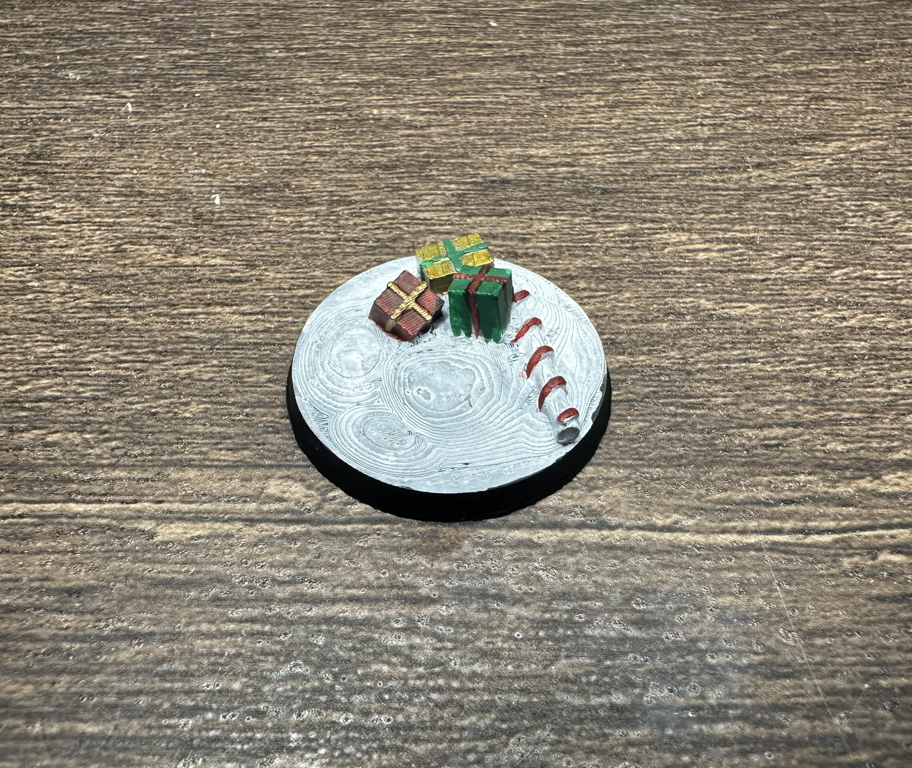
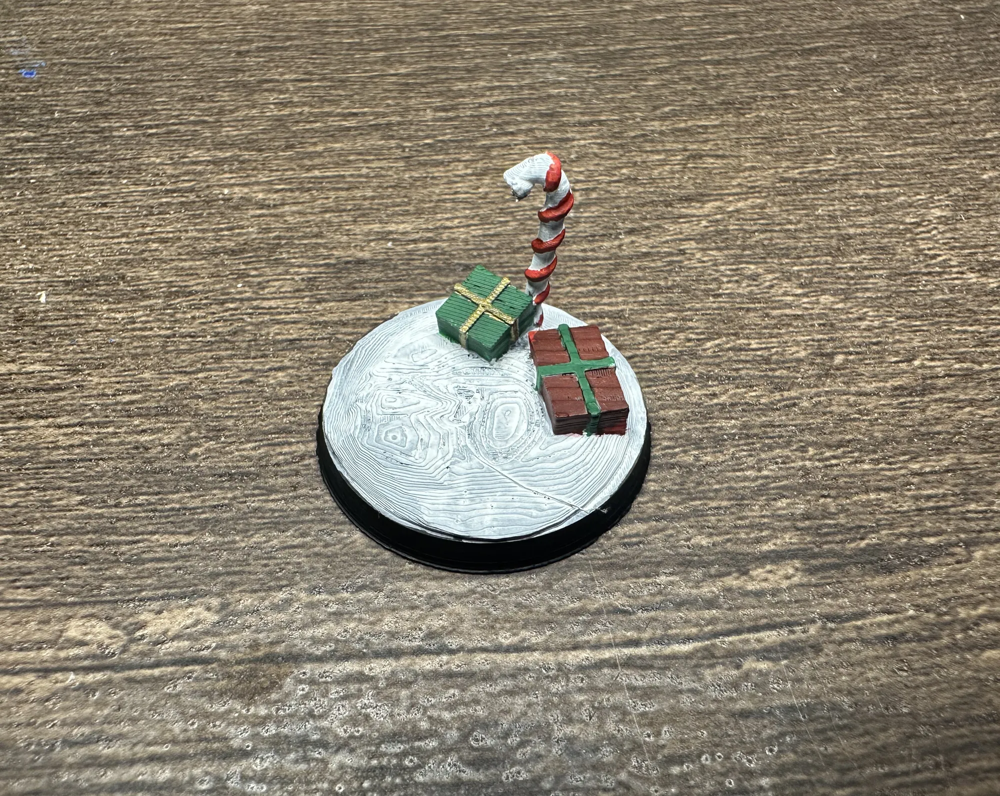
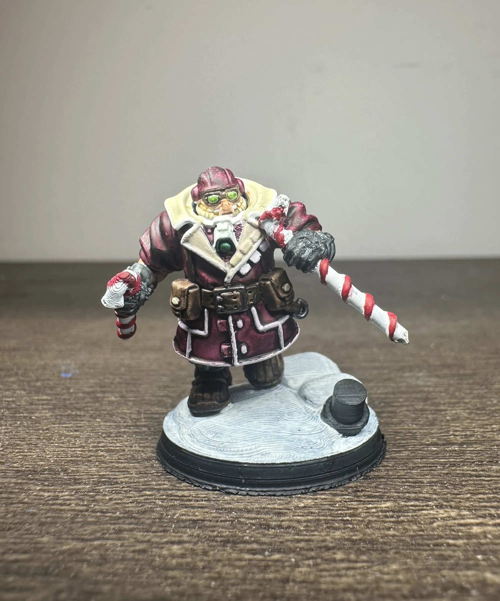

I wanted festive bases for a holiday painting project. Couldn't find exactly what I wanted online, so I opened up Blender and learned how to make my own. These are the first five designs I created from sculpt, to print, to paint. They're simple, printable, and best of all free.

## The Designs

Five 28mm bases, each with a different holiday scene sculpted into the top.

**Base 1: Logs**
A couple of yule logs laid across the base. Simple and works as a subtle seasonal touch without going full Santa's workshop.

**Base 2: Presents and Candy Cane**
Three wrapped presents with a candy cane lying across them. This one has the most going on and probably looks the best painted up with bright gift wrap colors.

**Base 3: Four Presents**
A pile of four wrapped boxes, different sizes. Good if you want the gift theme without the candy cane.

**Base 4: Logs, Present, and Sign**
A mix of elements including logs, a gift box, and a small sign. A little bit of everything on one base.

**Base 5: Standing Candy Cane with Presents**
A candy cane standing upright with presents around the base. The vertical candy cane gives this one some height, which is a nice visual break when it's sitting next to the flatter designs.

## Print Settings

These were printed on a **Bambu A1 Mini** with a **0.2mm nozzle** on the textured PEI plate. The fine nozzle picks up the small details on the presents and candy cane ridges nicely. The textured plate was a **pain** in the ass to get that first layer setup. I ended up having to offset my g-code to 0.06 to raise up the nozzle so that first layer or two weren't scraping. I am in the process of trying a flat plate. Could also probably try a 0.4 nozzle, but I was trying to get as much detail as possible out of this little baby printer.

| Setting | Value |
|---------|-------|
| Nozzle | 0.2mm |
| Layer height | 0.08mm |
| First layer height | 0.10mm |
| First layer temp | 225°C (stock is 220°C) |
| Z-offset (G-code) | G29.1 Z{0.06} for textured PEI plate |
| Max volumetric speed | 2 mm³/s |
| Everything else | Stock Bambu 0.2mm nozzle profile |

Only two changes from the default profile: first layer temperature bumped to 225°C and the Z-offset adjusted for the textured plate. That's it.

## Painting the Bases

Nothing fancy. White primer, speed paints, traditional Christmas colors. Red and green on the presents and candy canes, gold on ribbons and trim, brown on the logs. These are small bases with simple shapes and speed paints do exactly what you need them to in one coat with no fuss.

The whole set took maybe an hour start to finish. Prime, let dry, paint, done. That's the kind of low-effort, high-payoff project that's perfect for when you want to feel productive at the hobby desk without committing to a full evening.

**Logs**

Brown speed paint and done. A wash in the bark texture and these read immediately. Simple and effective.

**Presents and Candy Cane**

This one's the most fun to paint. Red and green gift wrap, gold ribbon, red and white candy cane stripes. It pops with color and has enough going on to look interesting without being complicated.

**Four Presents**

Four boxes, four chances to mix up your wrapping paper colors. Alternate your reds and greens so no two adjacent presents match. This helps give it that pile-of-gifts-under-the-tree look.

**Logs, Present, and Sign**

The sign is a nice detail here. A bit of white or cream on the sign face, brown on the post, and it reads as a little North Pole waypoint.

**Standing Candy Cane with Presents**

The vertical candy cane catches the eye. Red and white stripes are the only part that requires a steady hand with everything else being just filling in shapes.

## On a Mini

This kitbashed space dwarf dual-wielding 3D-printed candy canes might be the most aggressively festive thing I've painted. He's standing on a melted snowman base that's coming in Set 2. I couldn't resist pairing the two together early. The contrast between grim darkness and holiday cheer is the whole joke, and it lands harder when you commit to it like this. If you want to push the stylized look even further, the [comic book style approach](/workshop/comic-book-minis/) pairs surprisingly well with novelty bases like these.

## Download

**[Download Set 1 on MakerWorld](https://makerworld.com/en/models/2356375-christmas-themed-28mm-bases-5-pack#profileId-2577641)**: All 5 bases as STL files.

The second set of [Christmas Themed Wargaming Bases](https://makerworld.com/en/models/2434495-christmas-themed-war-gaming-bases-28mm-set-2#profileId-2670826) is also now available with more designs including a melted snowman base, snowball piles, and a santa sack. Check them out!

---

*These were my first Blender-to-printer designs. If you print and paint them in something other than traditional Christmas colors, I want to see it. Grimdark gingerbread, Nurgle Christmas, whatever you come up with. What about giving them a [toxic wasteland base](/workshop/toxic-wasteland-bases/) treatment?*
