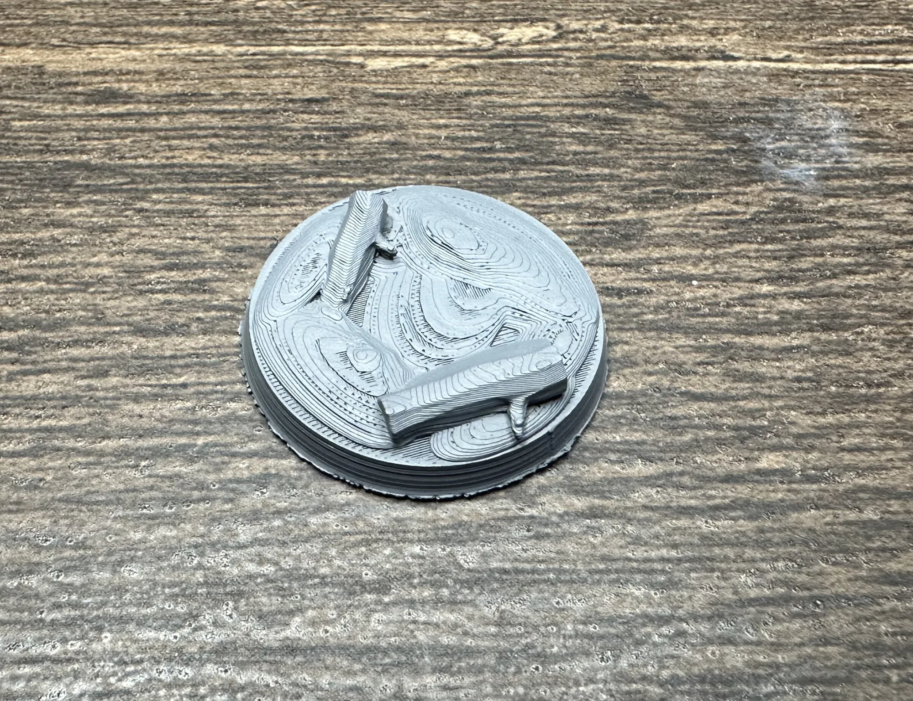
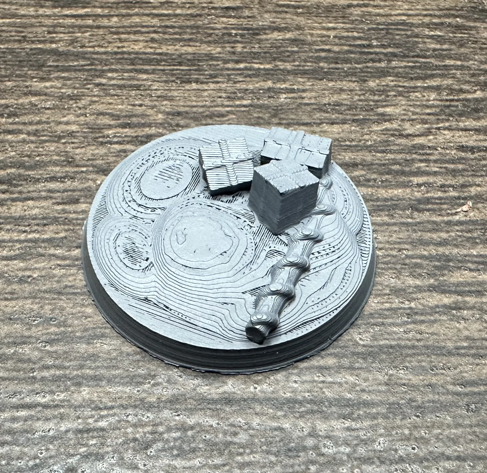
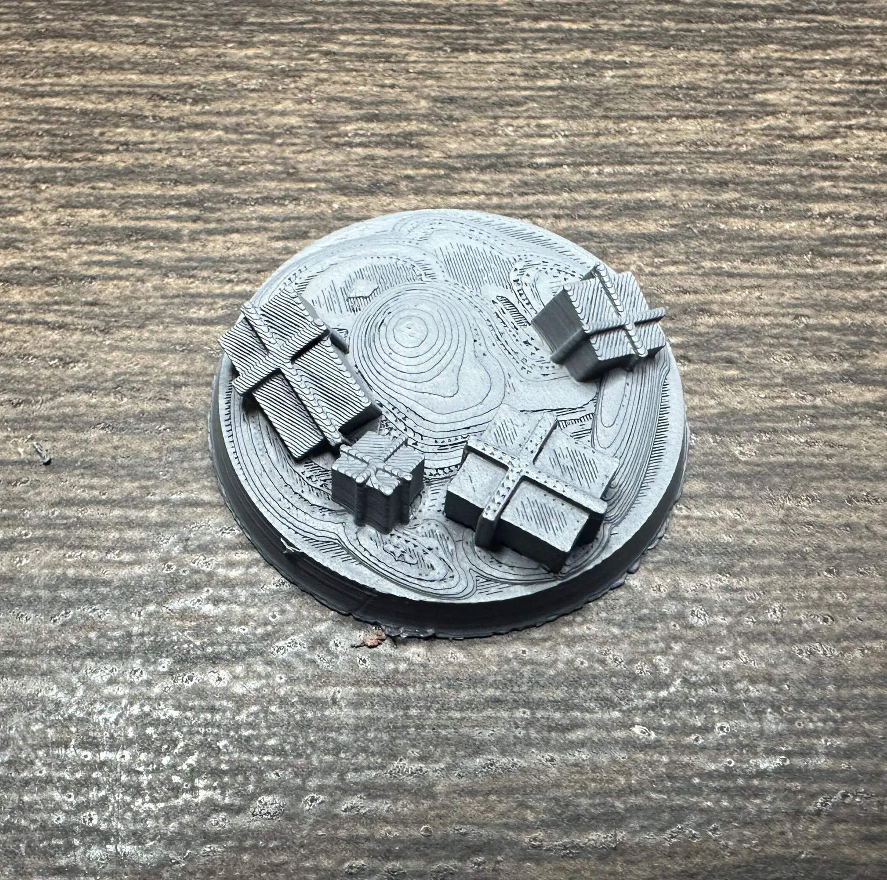
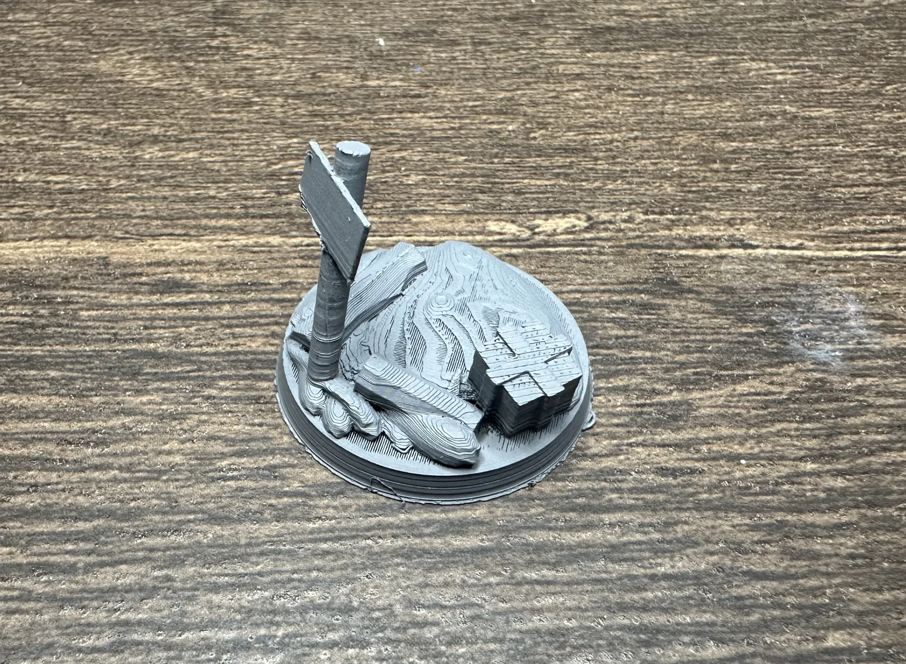
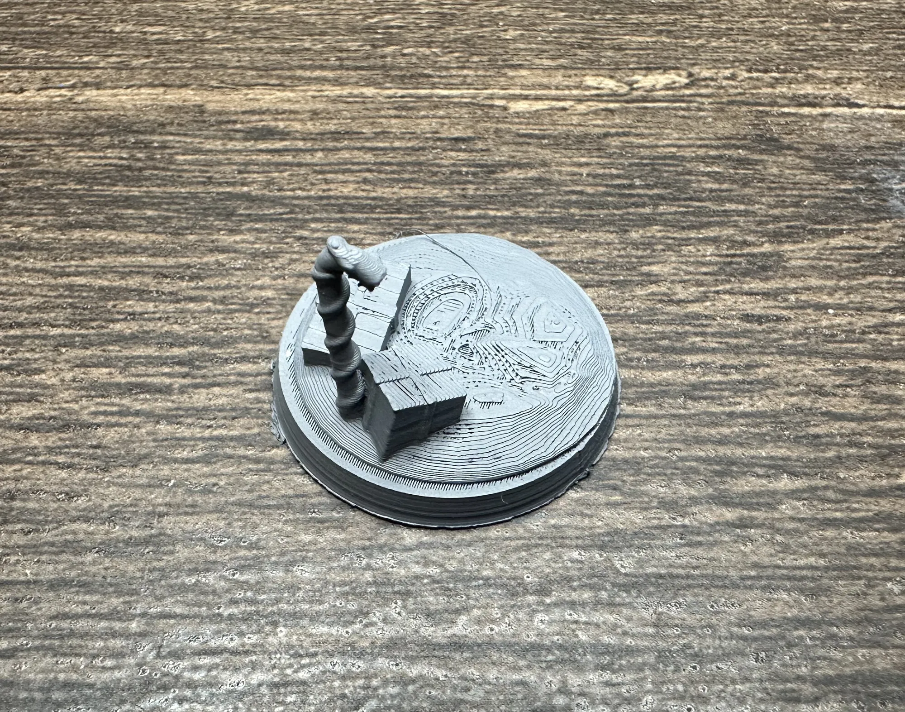

I wanted festive bases for a holiday painting project. Couldn't find exactly what I wanted online, so I opened up Blender and learned how to make my own. These are the first five designs I created. They're simple, printable, and best of all free.

## The Designs

Five 28mm bases, each with a different holiday scene sculpted into the top.

**Base 1: Logs**
A couple of yule logs laid across the base. Simple and works as a subtle seasonal touch without going full Santa's workshop.

**Base 2: Presents and Candy Cane**
Three wrapped presents with a candy cane lying across them. This one has the most going on and probably looks the best painted up with bright gift wrap colors.

**Base 3: Four Presents**
A pile of four wrapped boxes, different sizes. Good if you want the gift theme without the candy cane.

**Base 4: Logs, Present, and Sign**
A mix of elements including logs, a gift box, and a small sign. A little bit of everything on one base.

**Base 5: Standing Candy Cane with Presents**
A candy cane standing upright with presents around the base. The vertical candy cane gives this one some height, which is a nice visual break when it's sitting next to the flatter designs.

## Print Settings

These were printed on a **Bambu A1 Mini** with a **0.2mm nozzle** on the textured PEI plate. The fine nozzle picks up the small details on the presents and candy cane ridges nicely. The textured plate was a **pain** in the ass to get that first layer setup. I ended up having to offset my g-code to 0.06 to raise up the nozzle so that first layer or two weren't scraping. I am in the process of trying a flat plate. Could also probably try a 0.4 nozzle, but I was trying to get as much detail as possible out of this little baby printer.

| Setting | Value |
|---------|-------|
| Nozzle | 0.2mm |
| Layer height | 0.08mm |
| First layer height | 0.10mm |
| First layer temp | 225°C (stock is 220°C) |
| Z-offset (G-code) | G29.1 Z{0.06} for textured PEI plate |
| Max volumetric speed | 2 mm³/s |
| Everything else | Stock Bambu 0.2mm nozzle profile |

Only two changes from the default profile: first layer temperature bumped to 225°C and the Z-offset adjusted for the textured plate. 'That's it'.

## Download

**[Download on MakerWorld](https://makerworld.com/en/models/2356375-christmas-themed-28mm-bases-5-pack#profileId-2577641)** All 5 bases as STL files.

Christmas Base Set 2 is in the works with more designs including a melted snowman base. I'll link it here when it's ready.

---

*These were my first Blender-to-printer designs. If you print them, I'd love to see how they turn out, especially if you paint them in something other than traditional Christmas colors. Grimdark Christmas bases? Go for it. What about giving them a [toxic wasteland base](/workshop/toxic-wasteland-bases/) treatment? There's always the option for a [comic book themed mini](/workshop/comic-book-minis/) as well.*
