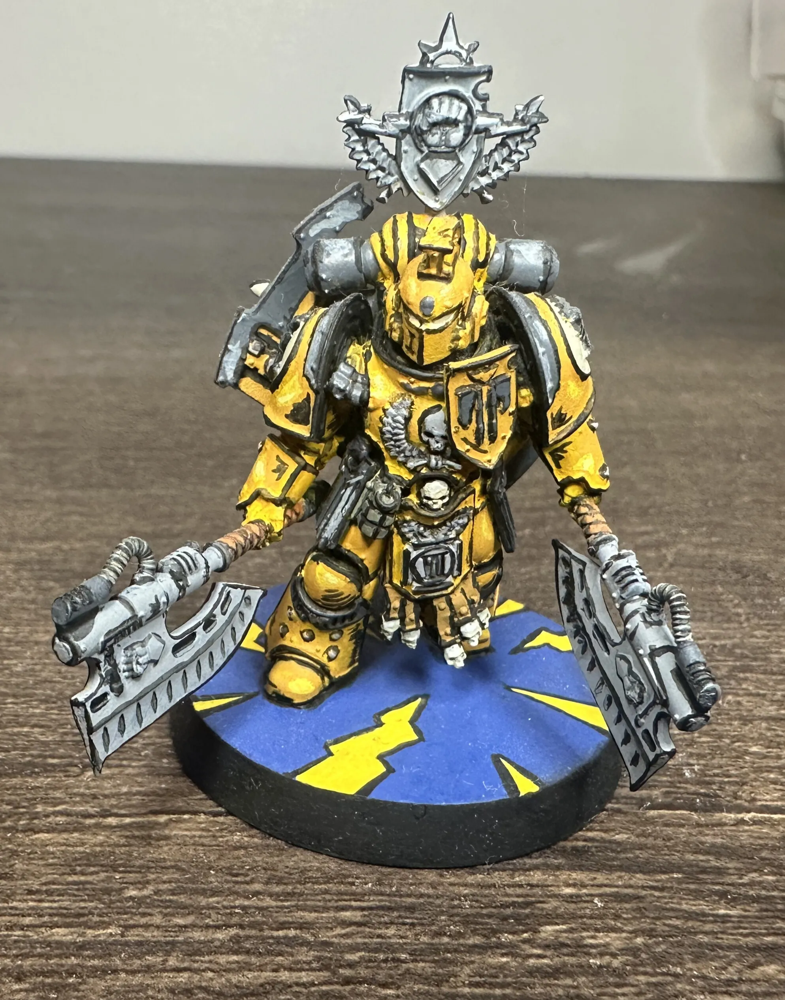
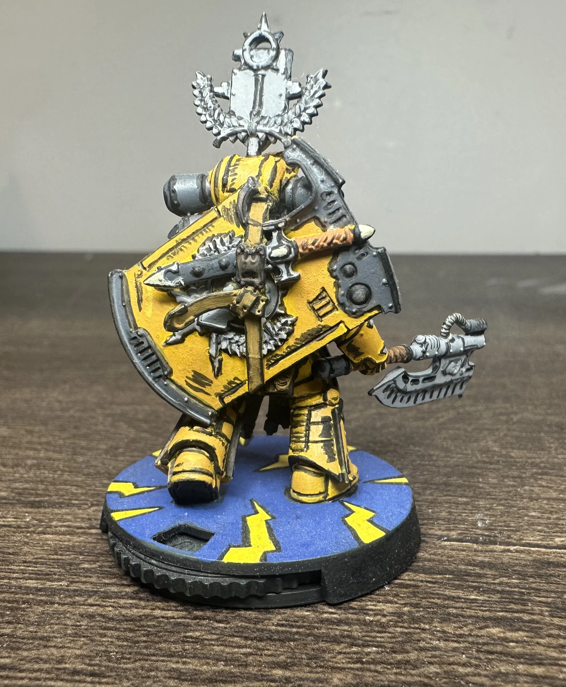
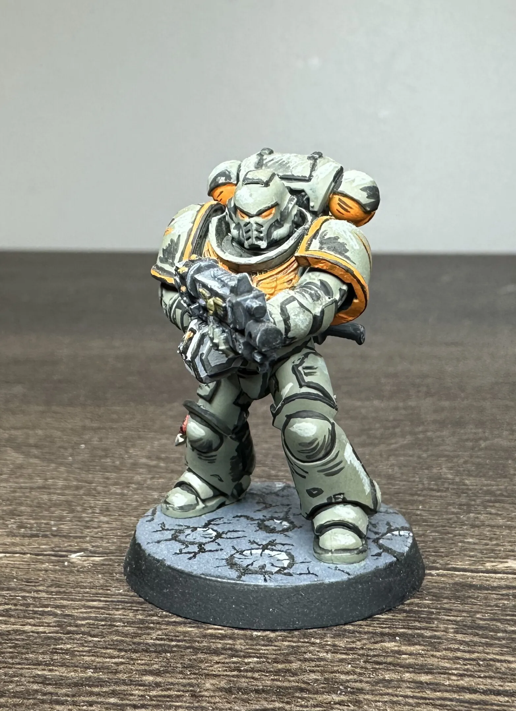
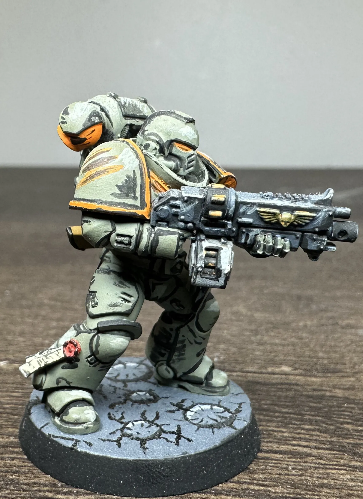
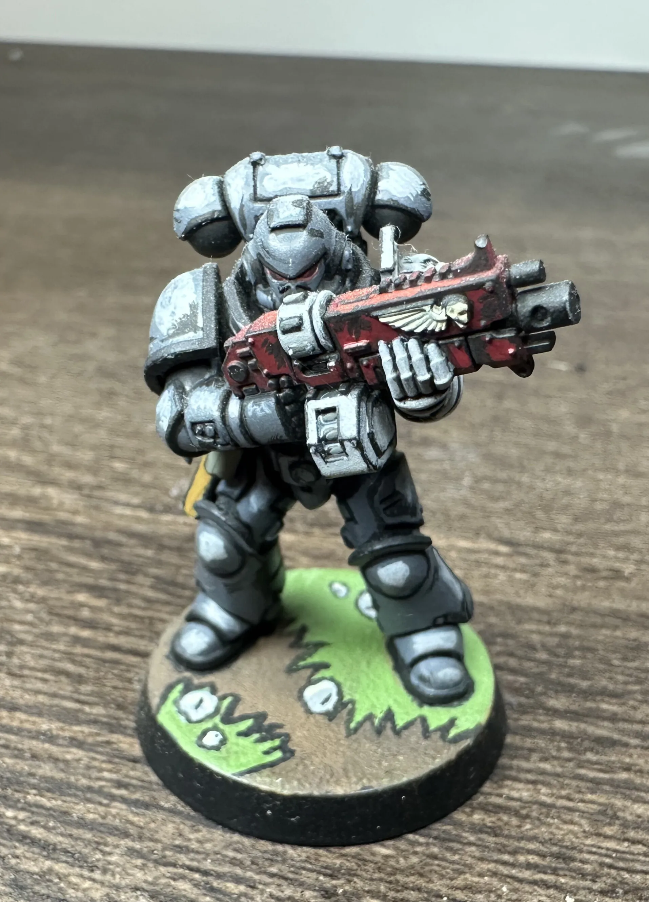
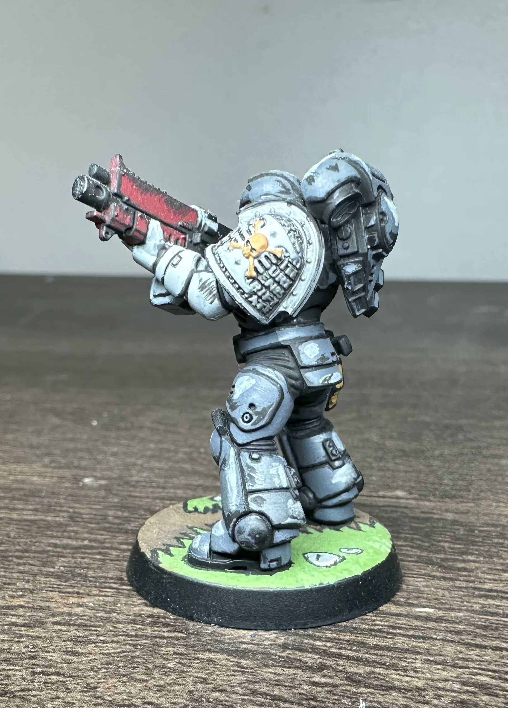
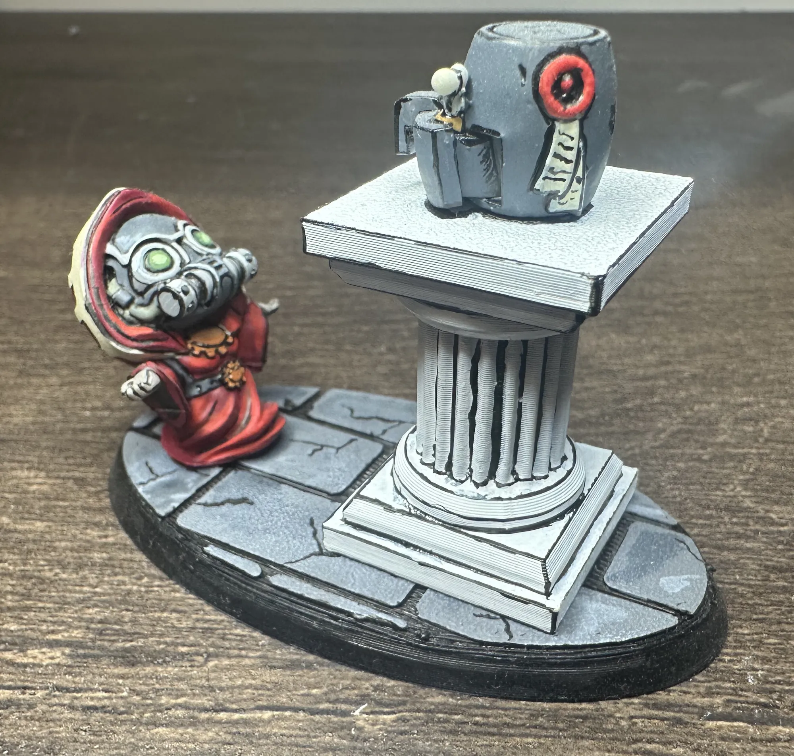
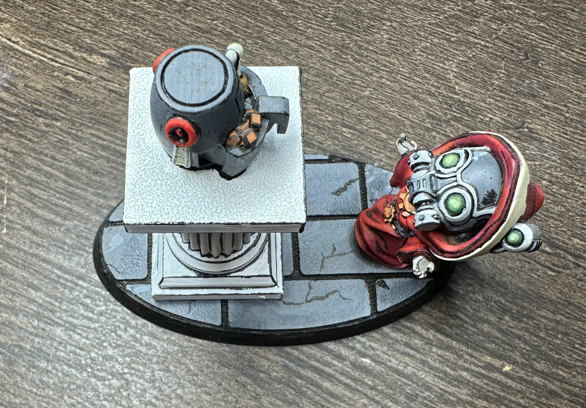

Most miniature painting advice points you toward smooth blends, thin layers, and invisible transitions. This is the opposite of that. This is bold black lines, punchy highlights, flat reads from across the table. Comic book style-ish.

It's not better or worse than traditional painting. It's just a completely different energy. A blended model looks like a tiny real person. A comic book model looks like it stepped out of a panel. Both are cool. To me,  This one's more fun.

<!-- TODO: Hero image — group shot of all five models together if possible -->

## What Makes It Comic Book

Two things do most of the work:

**Bold black edge lining.** Every edge where two surfaces meet gets a deliberate black line. Armor panels, cloth folds, weapon edges, anywhere there's a transition. In traditional painting you shade recesses and let the edges catch natural highlights. Here you're drawing the outline like an inker would. It flattens the model and reads like a drawing.

**Exaggerated highlights.** Where traditional painting builds up subtle gradients, comic book style jumps straight to the bright spots. You're not blending from dark blue to medium blue to light blue across a surface. You're putting the bright highlight exactly where light would hit hardest and letting the contrast do the talking. It looks wrong up close and perfect at arm's length. 

That's basically it. Black lines define the shapes. Hard highlights sell the lighting. Everything else is just picking colors and being decisive about where they go.

## The Models

### Fafnir Rann of the Imperial Fists, 30K

A Horus Heresy character done in the full comic book treatment. The yellow Imperial Fists armor is a great fit for this style and really makes the colors pop. The shield especially is where the style shines, all those straight edges with clean black lines between them.

Yellow is also notoriously annoying to paint traditionally (thin coats, multiple layers, streaking). Same happened here. It only took 7 coats. I've seen things about using a hot pink as the initial layer, but I haven't tried this yet. In comic book style you just commit to the color and that's what I did here. 

The base deserves a mention too! I did a simple blue with yellow lightning bolts painted right on, keeping the whole thing in that comic book flat-color energy. No texture paste, no extras, just bold shapes and color.

### Custom Chapter in Green and Orange

This one's not a real chapter. I added a few colors together that I thought would look cool. That's the beauty of comic book style on space marines: you're already working with bold flat panels and strong silhouettes, so any color scheme that has good contrast will work.

The green-grey armor with orange trim gives you warm-cool contrast. The black lining between the armor panels and around the shoulder pads is what really makes the orange trim pop. The cracked moon style base keeps the comic styling going. With the dark lines radiating out of the craters, it looks almost like impact cracks are coming out at you.

### Deathwatch Space Marine

Silver and 'black' with a red bolter casing. The Deathwatch scheme is already high-contrast, so the comic book treatment amplifies what's already there. The silver armor gets hard white edge highlights that read as reflective glints, and the black lining between silver panels gives every piece of the armor a defined shape. The black on the armor is really a Deep Grey. I had to go grey because you need highlights and shadows with comic book style, and its hard to add a shadow to black. 

The red bolter is a nice focal point against all that silver-black. And the base patined as [bright green comic book grass with bold outlines](https://www.youtube.com/watch?v=zvu347jg4V4&list=PLNNJC5RXt26zWQUmwO4j-dj28J_jyoAen&index=33) is probably the most overtly "comic panel" element on any of these models. It doesn't look like real grass. It looks like someone drew grass. That's the point, duh.

### Blood Angels Marine

<!-- TODO: Blood Angels marine photo — showing red armor with comic book treatment -->

Red armor is another scheme that benefits from this approach. The comic book highlights on red read as dramatic lighting. It's like a comic panel where the Blood Angel is stepping into the light, bright flashes off the helmet and shoulder pads. The black lining between red panels gives the armor definition without needing to shade with darker reds or washes.

### Adeptus Mechanicus Chibi Praying to an Air Fryer

Yes, it's exactly what it sounds like. A chibi Adeptus Mechanicus tech-priest on their knees in devotion before an air fryer on an ancient pedestal. The Omnissiah works in mysterious and delicious ways. I have always enjoyed creating [stories and lore for the miniatures](/workshop/dioramas-and-storytelling/) I build and this model was no execption. 

Chibi models are already halfway to comic book style with their exaggerated proportions, so the bold lining and hard highlights feel completely natural here. The red robes with white edge highlights, the glowing green lenses, the grey stone base with black line work in the cracks...  everything reads immediately. The air fryer itself is the best part, in my opinion. It's cute and sitting on that pedestal like a sacred relic. The comic book styling of the scene makes the whole thing really come together.

This one's pure fun. No lore justification needed. Although, I am sure there are some out there. 

## Why Try It

It's fast, it's semi-forgiving, it turns heads, and it's fun! People notice comic book minis on the table because they look different from everything around them. There's no "is that highlight smooth enough" anxiety. The whole point is hard edges and bold marks.

It works on (pretty much) any model too. From Horus Heresy characters to chibi joke pieces to standard infantry, if it has edges, it'll take black lining. 

If you've been painting for a while and everything's starting to feel like the same process on different models, try this on something small. Pick a model you're not precious about, grab a fine-tip brush for the lining, and just go for it. Worst case you mess it up and get to try again. Best case you find a style that makes painting fun in a way it hasn't been for a minute.

<!-- TODO: Gallery of all comic book minis together -->

---

*For something completely different, check out my [Death Guard paint scheme](/workshop/death-guard-paint-scheme) about as far from comic book style as you can get. And the Mandrake Kill Team getting the full comic book treatment will get its own post when the squad is finished.*
