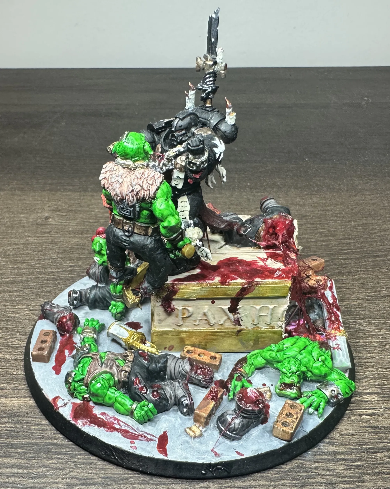
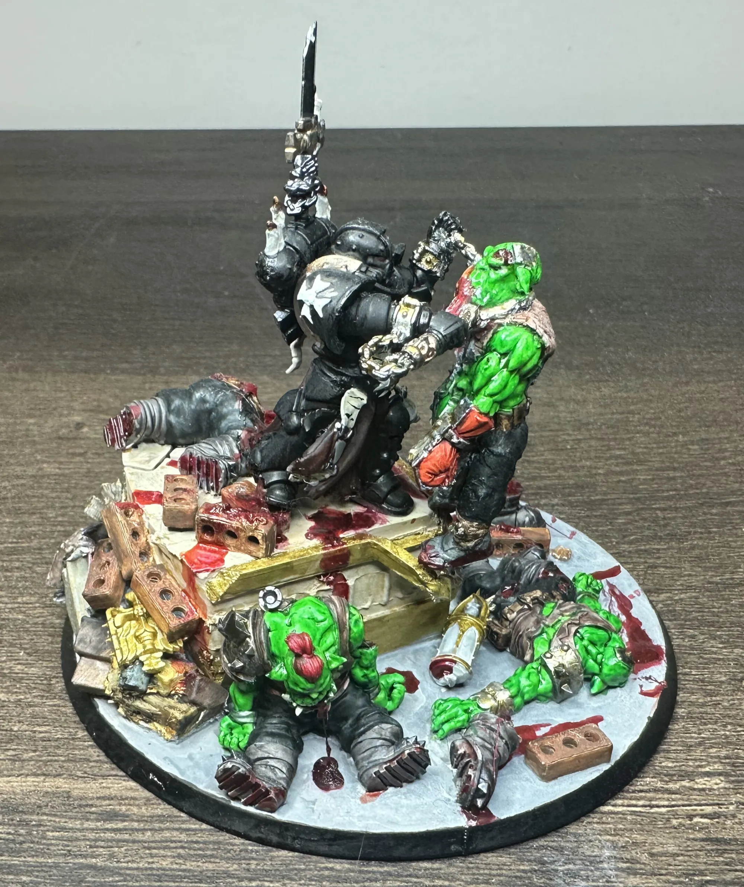
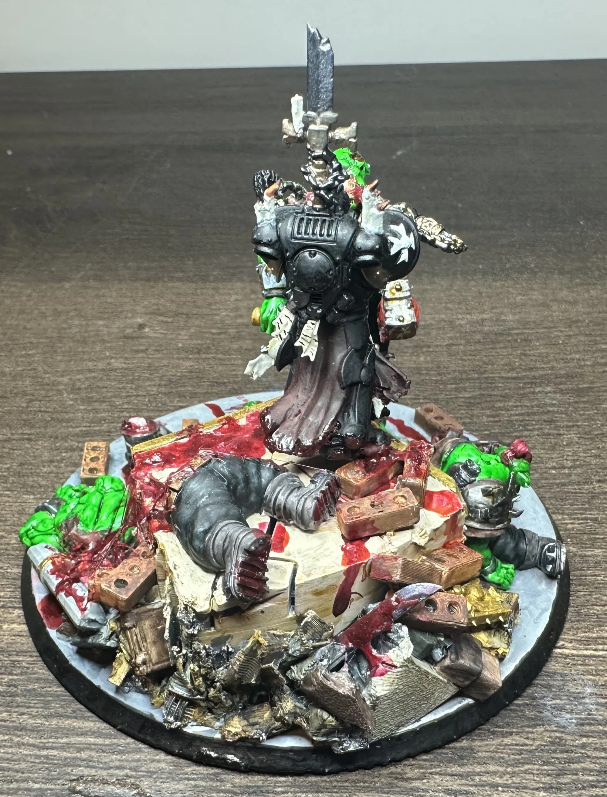
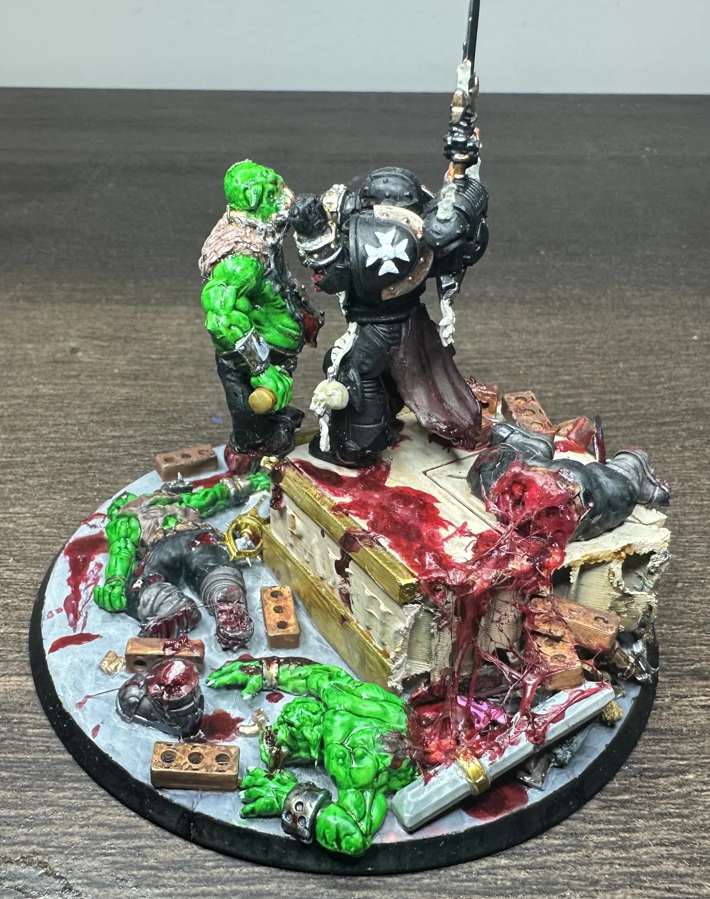
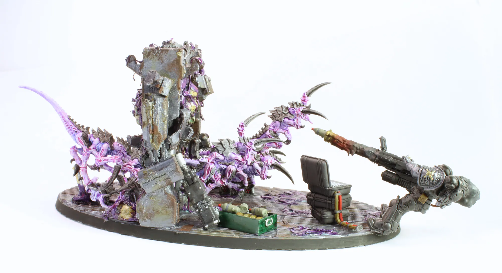
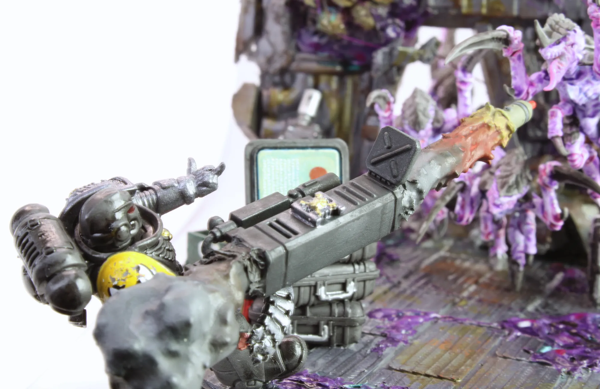
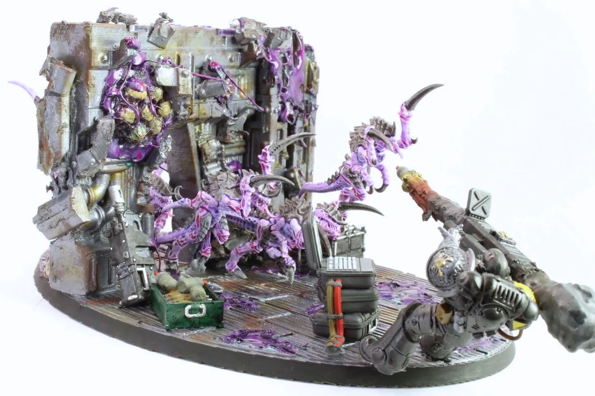
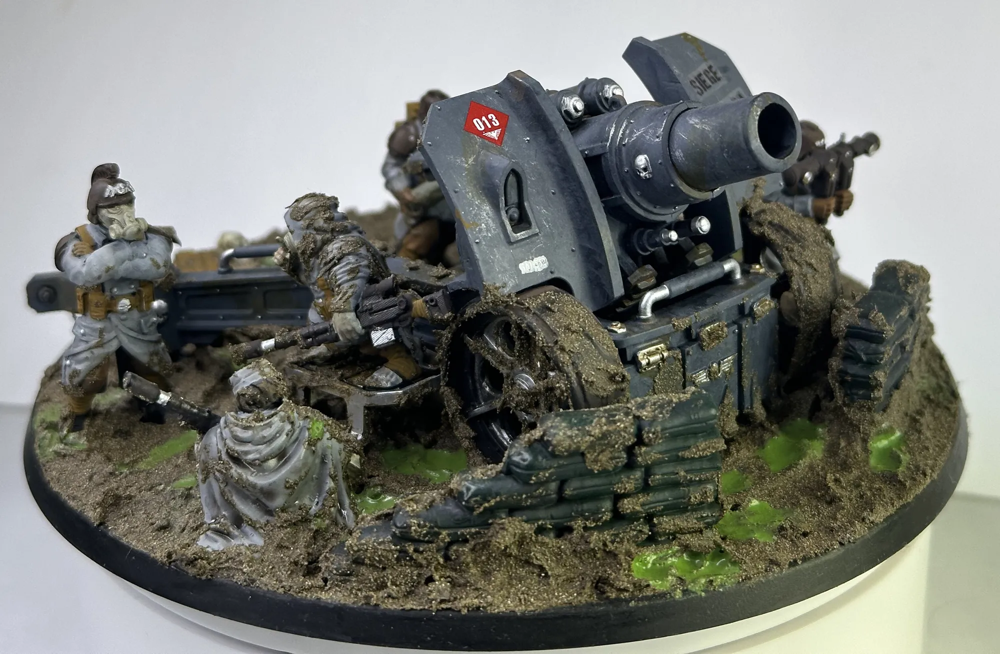
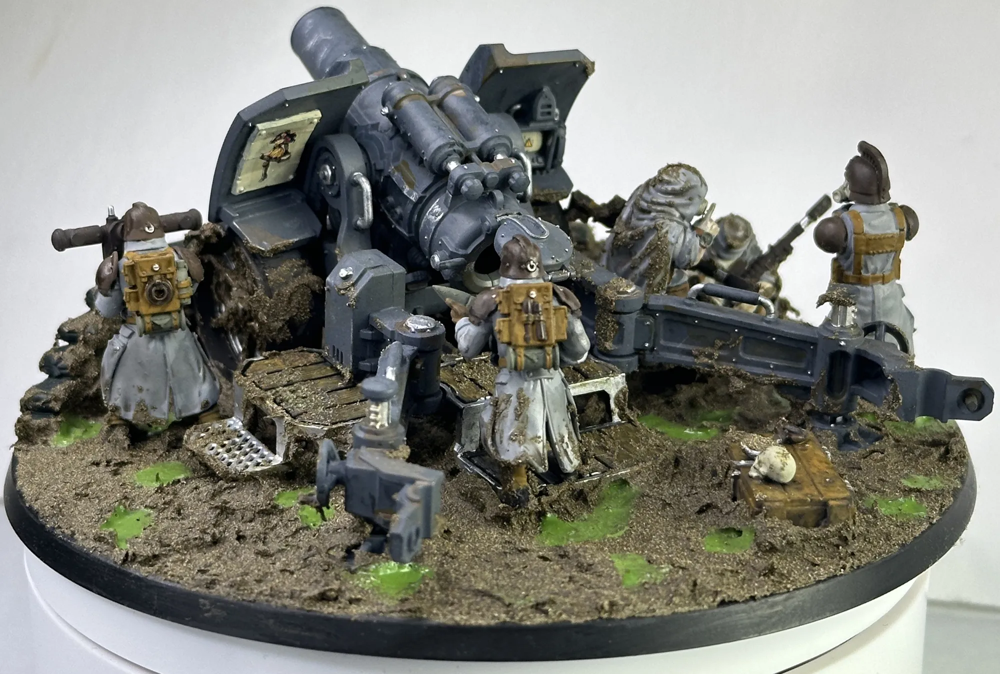
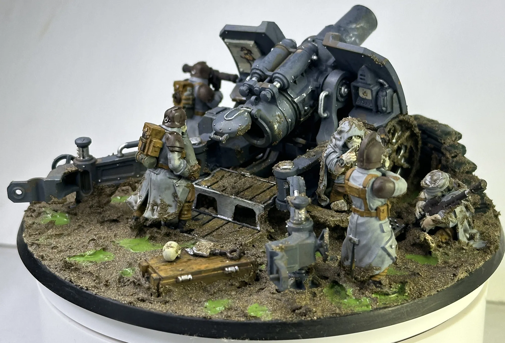

A miniature on a plain base is a game piece. A miniature that looks like it's in the middle of doing something is a story. The difference between the two is usually about an hour of extra work and a willingness to chop up models you paid good money for.

I've been pushing myself to think less about "how do I paint this model" and more about "what is this model doing right now." That applies at every scale. Whether I'm working with full dioramas with custom terrain down or a single infantry model with a muddy base and a bit of attitude. Here's some of what I've built and a bit of what I've learned.

## The Dioramas

### Grimaldus at Helsreach: The Last Stand

If you know the [Helsreach story](https://www.blacklibrary.com/warhammer-40000/novels/helsreach-ebook.html), you know the scene. The cathedral is falling. Everything is lost. And Grimaldus is still fighting. Standing on a broken altar, above the wreckage and choking the life out of an ork. Because that's what Black Templars do when the situation is completely hopeless.

I wanted to capture that specific moment. Not the wider battle, not the last stand in general, just Grimaldus, mid-strangle, refusing to die in a pile of cathedral rubble.

**Building the base:** I 3D printed an altar and then took a knife to it. Cut it apart, broke pieces off, mixed it with random bits and debris to create a rubble pile that reads as "this was sacred ground about ten minutes ago." The key was making it look destroyed but still recognizable. I needed enough intact detail that the eye fills in what the sacred altar used to look like. If it's too smashed up it just looks like a pile of rocks.

The positioning was everything. Grimaldus had to be elevated enough that the ork "hanging" sells visually. Getting that sense of weight and gravity right with the ork's body hanging down while Grimaldus holds on to his throat is what can make it feel like a moment frozen in time rather than two models glued near each other.

### Space Marine vs. Tyranids, Going Out on Your Own Terms

This one started as a joke and ended up being my favorite piece.

A lone space marine, completely overrun by tyranids, firing a rocket launcher at point-blank range. And with his other hand, flipping them off. No retreat. Just pure defiance and a last 'F you'.

**The kitbash:** The middle finger was the whole reason this diorama exists, so it had to look right. I took a standard space marine arm, used a razor blade to carefully cut between the fingers, then slowly bent each non-middle finger down into a closed fist position, leaving the thumb sticking out naturally. It was delicate work. Go too fast and the space marine might not be the only one with a sliced hand. But when it works, it works. 

The rocket launcher at close range is what makes the scene funny instead of just defiant. He knows this is going to kill him too. He does not care. That's the kind of energy I want in a diorama. Moments where you can read scene without any text or lore explanation.

### 508th Siege Regiment Artillery Crew

This one isn't a traditional diorama on a display base. It's the Krieg artillery kit, but instead of just assembling it stock and putting it on the table, I wanted it to feel like a snapshot of life in the trenches.

The gun crew is in position, mud everywhere, toxic puddles pooling around the base. Water transfers add some fun details to the big gun. And then there's the soldier who's fallen asleep on the job. Shame. And the other crew member who's caught him doing it.

The sleeping soldier getting scorned turns a standard artillery piece into a scene. You can hear the argument. You can imagine what happens next. It's a tiny piece of military life that makes the whole unit feel like real people instead of identical guardsmen pointing guns at things. I also find the irony of sleeping next to artillery and being told to 'shush' funny.

**The basing work** ties it all together. Thick mud built up around the gun platform, toxic puddles using the toxic puddle idea technique from my [Death Guard bases](/workshop/toxic-wasteland-bases/) but in a more muted, non-nurgle palette. The whole thing looks like it's been sitting in the same churned-up position for days.

## How I Think About Storytelling at Every Scale

You don't need a full diorama to tell a story. The same thinking scales down to individual models.

**Ask "what just happened?"** Before you base or pose a model, imagine the two seconds before this moment. Did they just land from a jump? Are they bracing against an explosion? Did they just kill something and they're looking for the next target? That context changes how you position the model and what goes on the base.

**One detail carries the narrative.** The sleeping soldier. The middle finger. Grimaldus's grip on the ork's throat. You don't need ten storytelling elements. Pick one that's strong enough to anchor everything else. Even if it's an [Adeptus Chibi worshiping an airfyer](/workshop/comic-book-minis/). If someone glances at the model and immediately understands what's happening, you've done it.

**The base is half the story.** A model standing on a textured base is fine. A model standing in a puddle that's forming around its feet tells you it's been standing there a while. A model on a pile of rubble tells you something just got destroyed. The base isn't decoration it's the setting for your story.

**Commit to the bit.** The space marine with the rocket launcher is a stupid idea tactically. It's a great idea for a diorama because it commits fully to one clear emotion. The Krieg soldier falling asleep at his post is a small, quiet moment in a game about galactic warfare. That contrast is what makes it memorable. Don't play it safe with your scenes! Weird, specific, slightly ridiculous ideas are the ones people actually remember.

<!-- TODO: Gallery of all three pieces together -->

---

*The 508th Siege Regiment will get a full army showcase post of its own. This is just a taste of what the Krieg are up to.*
