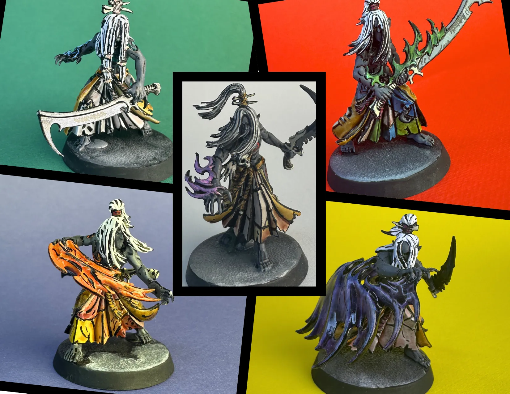
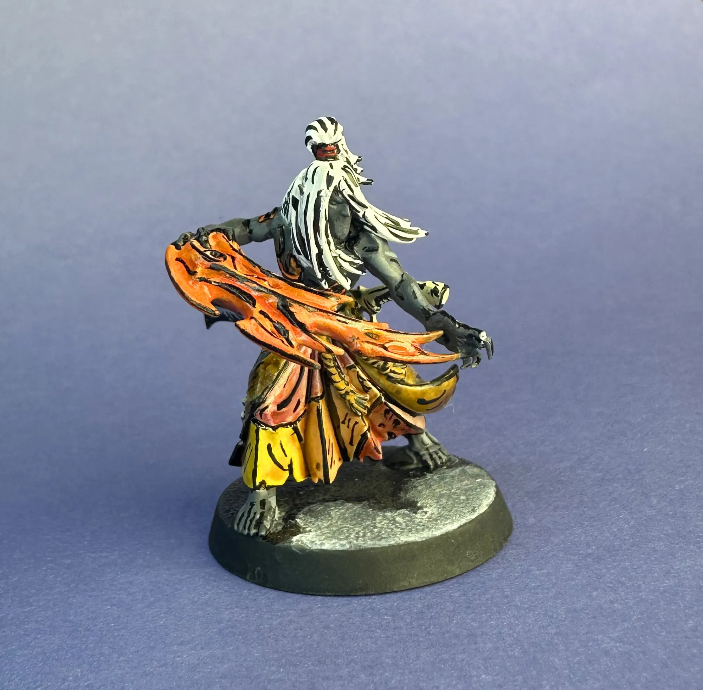
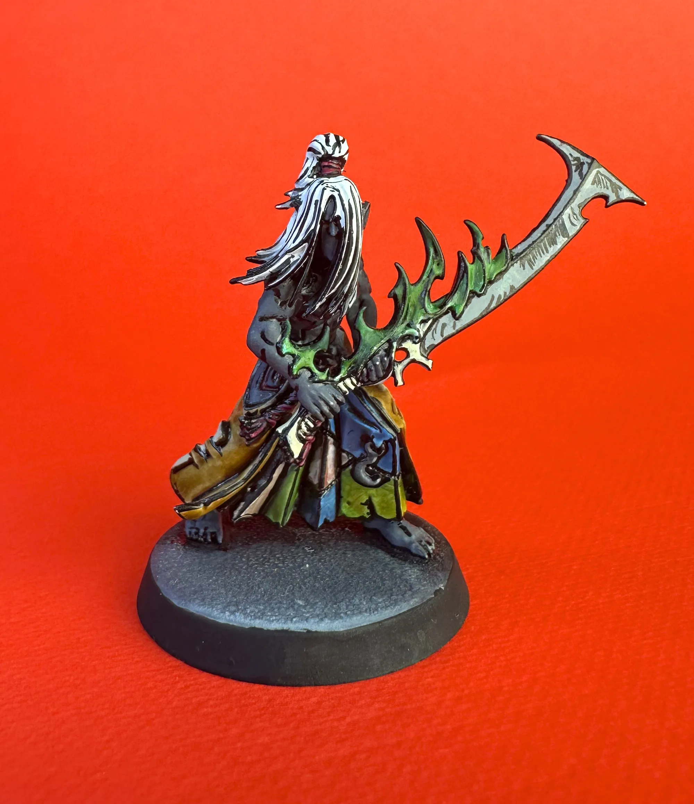
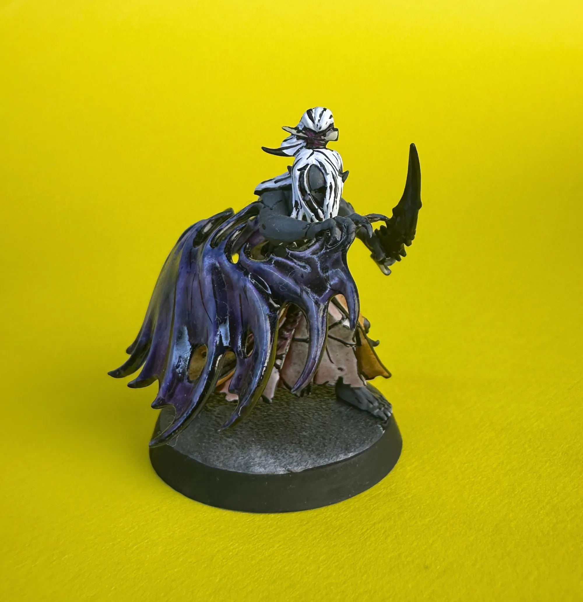
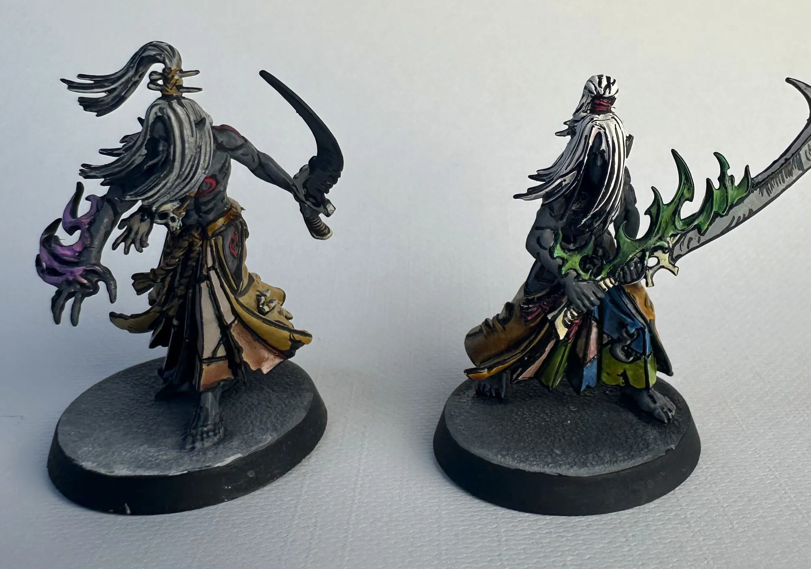
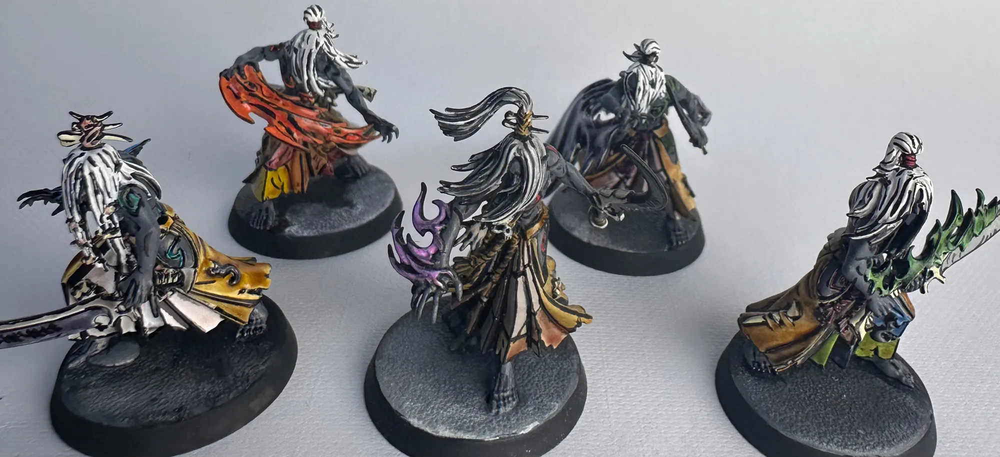

I set a goal over a year ago: paint an entire Kill Team in [comic book style](/workshop/comic-book-minis/). Not a single model as a novelty — a whole playable squad. I picked [Mandrakes](https://wh40k.lexicanum.com/wiki/Mandrake) because they felt like the right fit. Shadow creatures covered in stolen skin, wrapped in dark flame. The heavy black linework of comic book style and beings made of shadow just made sense together.

This post covers the first five. The second five are getting a different approach — speed paints instead of regular paints — so consider this the baseline half of an experiment.

## Why Mandrakes

Mandrakes are wild in the lore. They live in a shadow dimension, and anywhere there's a shadow they can just step out of it. Nobody really messes with them — not even other Drukhari. They steal the skin of their victims and wear it stitched together as trophies.

That last part matters for the paint scheme. All those patches of stitched skin become distinct color blocks on the model — perfect for comic book style, where you want clearly defined shapes separated by bold black lines. Each patch gets its own color, and the black linework does the rest.

The shadow angle also inspired the basing. More on that below.

## The Process

Comic book style on miniatures mirrors how actual comics are made. Pencils first, then color, then ink. On a mini, that translates to:

1. **Prime white** — I use white primer, then paint Dead White over the top to make sure the white is really pure and even. This matters because every color is going over white and needs to read as bright and vivid. A patchy undercoat kills the effect.

2. **Paint all the colors** — everything gets its base color before any black lines go down. Skin, cloth, weapons, flames, hair — all of it.

3. **Black lines last** — this is the inking pass. Once all the color is laid down, every edge, every transition, every defining line gets hit with black ink.

The order matters. You're coloring in the illustration, then inking it. Just like a comic.

## Paint Recipes

Here's what I used across the first five:

**Mandrake Skin (body):** Deep Grey — one coat over the white base. Simple and effective.

**Hair:** Dead White left as the base, then defined with black ink lines between the strands. This was a big lesson from model one to model two — brighter hair makes the whole model pop harder. The white hair with black ink lines reads almost like manga character art.

**Robes/Cloth:** Sepia wash over white. You get a warm parchment-yellow tone without having to layer up yellow from scratch, and the wash naturally catches in the folds to give you built-in shading. Efficient and it still reads as bright comic book color.

**Skin Patches (stolen skin trophies):** This is where each model gets its own identity. Different washes per model — one got yellows and reds, another greens and blues, some got flesh washes for that extra creepy touch of actual skin-colored stolen skin. All washes over the white base.

**Weapons/Blades:** White base with black ink linework.

**Energy/Flame Effects:** Different colors per model — greens, oranges. These are freehanded on before the black lines, then outlined in black from every angle. These were the hardest part. Organic flame shapes with clean black edges that need to read from every viewing angle.

**Black Linework:** Higgins Black Magic ink. Regular black paint isn't dark enough. The ink gives you a deep, saturated true black that really sells the drawn look. I use a fine brush and just work my way around every edge on the model.

## The Black Lines

This is the whole style, and it's the scariest part. You've spent time getting all the colors down and now you're dragging black ink across finished work. One thick line and you're looking at a correction.

A few things I learned:

**Push through.** It doesn't look good at first. Mid-process, a comic book mini looks like a mess — flat colors with no definition, then weird half-lined sections that look wrong. The effect doesn't click until you're most of the way through the inking pass. If you bail because it looks bad halfway through, you never get to the payoff.

**It's supposed to look hand-drawn.** These are comic book style, which means drawn. Slightly wobbly or uneven lines actually add to the authenticity. If every line were laser-perfect it would look more like a decal than a hand-inked illustration. The slight irregularity is what makes it read as comic style rather than just a miniature with black lines on it.

**Brighter base colors.** This was the biggest lesson from model one to model two. The black lines eat up visual brightness, so your underlying colors need to be cranked up to compensate. I made the hair much brighter on the second model and the difference was immediately obvious. The first model still has the original darker hair — you can compare them side by side.

**Fixing mistakes.** When a line goes bad — usually way too thick — I layer Dead White over the mistake area until it's covered, then redo the color underneath, then redo the line. It's basically a local reset. It's tedious but the alternative is living with a thick blob that breaks the comic illusion.

**90 minutes.** The fifth model's full black line pass took about 90 minutes. It seems daunting to look at a whole model and think about lining every single edge, but it goes quicker than you'd expect. And being a bit less precise didn't make it look much worse — the comic book effect still reads the same. Speed comes with repetition.

**Rust is real.** I worked on these on and off for almost a year. Coming back to fine linework after months away, my hand was noticeably less steady. It warms back up over the course of a model, but those first few lines are rough. Something to be aware of if you're picking a project like this up and putting it down.

## The Bases

I wanted the bases to look like the Mandrakes are emerging from shadows — stepping out of darkness into the scene. I did wet blending across the base using black, Deep Grey, a lighter grey, and white, trying different strengths and ratios on each model to see what worked best.

They turned out okay. I'm not sure they completely capture the shadow-emergence effect I was going for, but as a group they work well enough. Having five slightly different approaches means I can look at them together and decide which ratio to use as the template for the next five.

## Each Model Has Its Own Color Story

I gave each Mandrake a different color palette for two reasons. First, I get bored easy and like to switch it up — no point pretending there's a deep lore reason when the real answer is I wanted to try something different on each one. Second, it's practical: in Kill Team you need to quickly tell individual operatives apart during a game. Different flame colors and skin patch palettes make that instant.

## What's Next

The first five are done. Five more to go.

Here's the experiment: the next five Mandrakes are getting painted with Speed Paints instead of regular paints and washes. Same white base, same Higgins Black Magic ink for the lines — but Speed Paints in between. They'll give me vibrant color with built-in shading in a single coat, which means the models will have actual depth and contrast before the black lines even go on. It could end up looking like a more modern comic style compared to the flatter wash-based approach on the first batch.

When all ten are done, I'll put them side by side and we can see which approach works better — or if they just look different enough to both be worth doing.

I haven't gotten this team on the table for a game yet, but there's no rush. I'm more excited to see the full squad come together than I am to play them. Only five more to go.

---

*For a look at how I approach paint schemes from scratch, check out my [Death Guard paint scheme](/workshop/death-guard-paint-scheme/) breakdown.*
