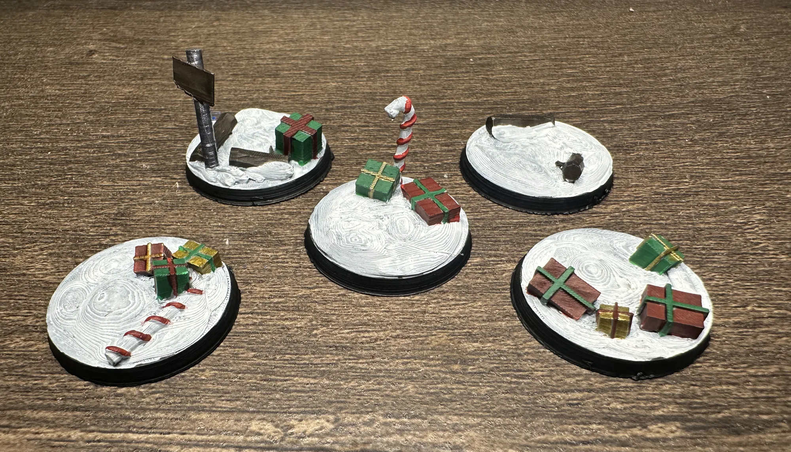
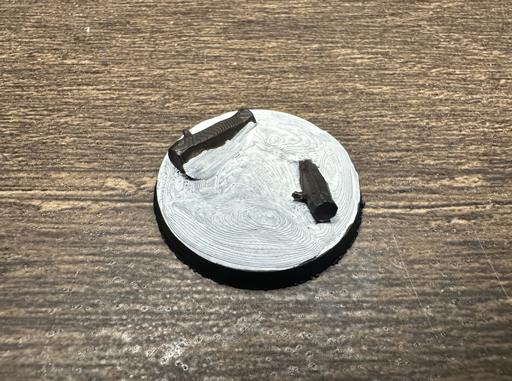
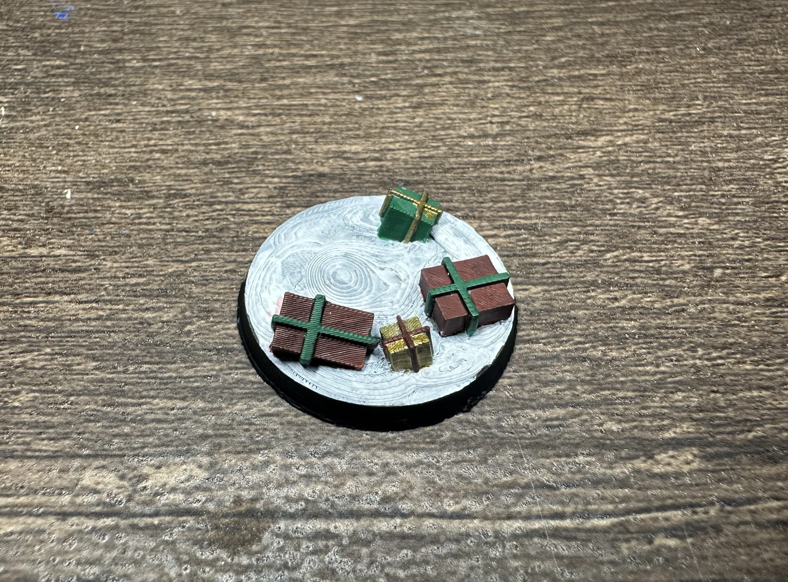

I posted the [STL files for these bases](/workshop/christmas-bases/) a while back, but bare plastic doesn't really sell the holiday spirit. Here's what they look like with some paint on them.

## The Paint Job

Nothing fancy. White primer, speed paints, traditional Christmas colors. Red and green on the presents and candy canes, gold on ribbons and trim, brown on the logs. These are small bases with simple shapes and speed paints do exactly what you need them to in one coat with no fuss.

The whole set took maybe an hour start to finish. Prime, let dry, paint, done. That's the kind of low-effort, high-payoff project that's perfect for when you want to feel productive at the hobby desk without committing to a full evening.

## The Bases

**Base 1 — Logs**

Brown speed paint and done. A wash in the bark texture and these read immediately. Simple and effective.

**Base 2 — Presents and Candy Cane**

This one's the most fun to paint. Red and green gift wrap, gold ribbon, red and white candy cane stripes. It pops with color and has enough going on to look interesting without being complicated.

**Base 3 — Four Presents**

Four boxes, four chances to mix up your wrapping paper colors. Alternate your reds and greens so no two adjacent presents match. This helps gives it that pile-of-gifts-under-the-tree look.

**Base 4 — Logs, Present, and Sign**

The sign is a nice detail here. A bit of white or cream on the sign face, brown on the post, and it reads as a little North Pole waypoint.

**Base 5 — Standing Candy Cane with Presents**

The vertical candy cane catches the eye. Red and white stripes are the only part that requires a steady hand with everything else being just filling in shapes.

## With a Mini

This kitbashed space dwarf dual-wielding 3D-printed candy canes might be the most aggressively festive thing I've painted. He's standing on a melted snowman base that's coming in Set 2. I couldn't resist pairing the two together early. The contrast between grim darkness and holiday cheer is the whole joke, and it lands harder when you commit to it like this. If you want to push the stylized look even further, the [comic book style approach](/workshop/comic-book-minis/) pairs surprisingly well with novelty bases like these.

## Get the Files

The STLs are free on MakerWorld. Print settings and design details are in the [original download post](/workshop/christmas-bases/).

**[Download on MakerWorld](https://makerworld.com/en/models/2356375-christmas-themed-28mm-bases-5-pack#profileId-2577641)**

---

*Set 2 is in the works with more designs. If you paint these up in something other than traditional Christmas colors, I want to see it. Grimdark gingerbread, Nurgle Christmas, whatever you come up with be sure to share.*
