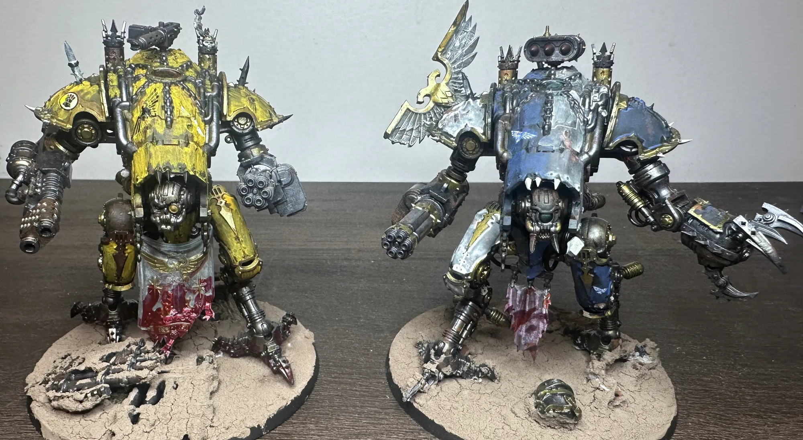
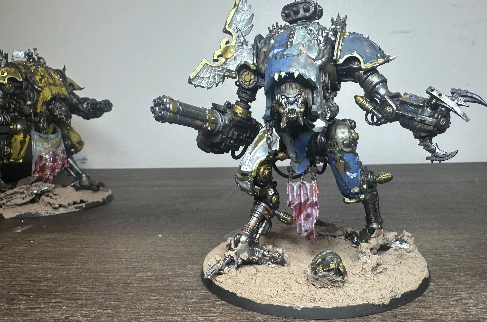
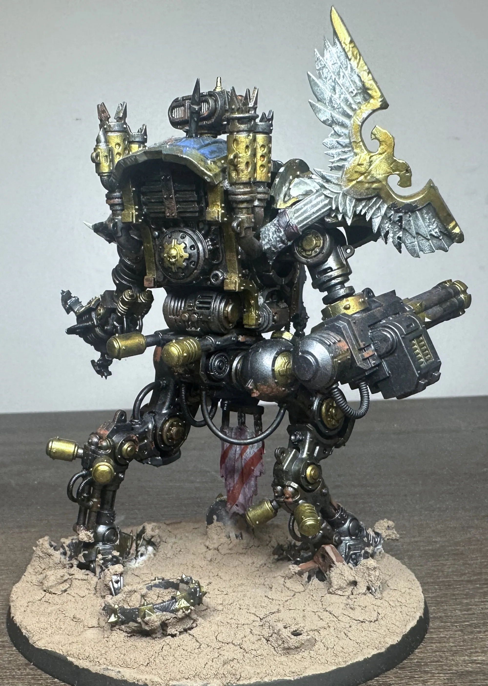
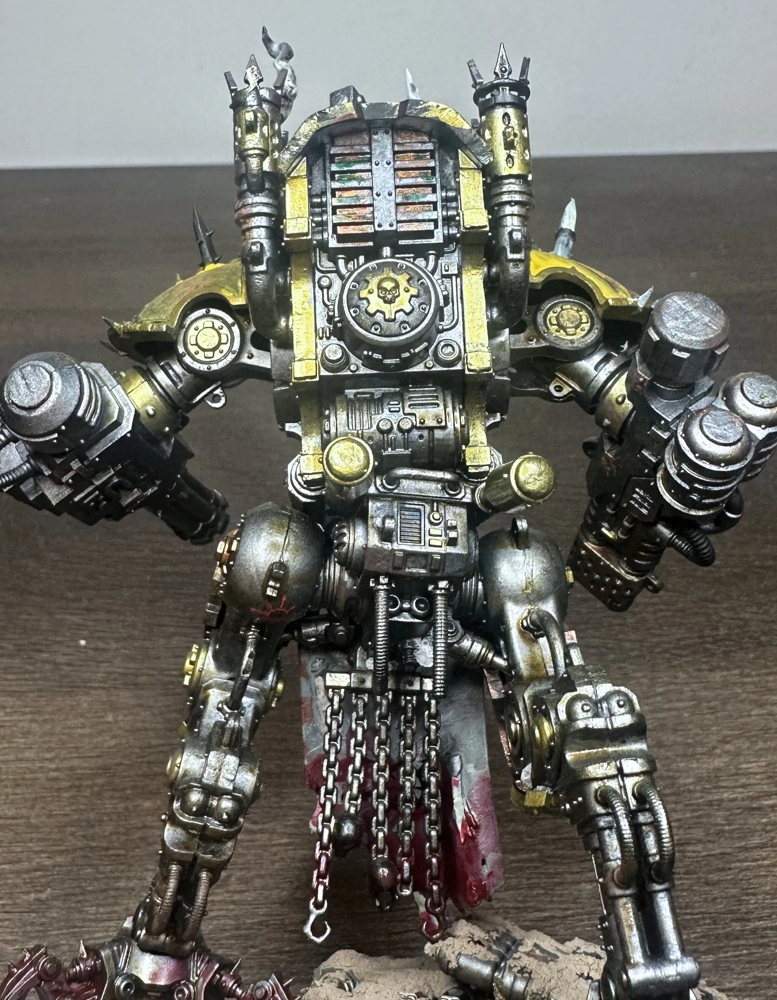

The Death Guard hit the Krieg's trench line and bounced. Hard. A small patrol probing for weak points in the 508th Siege Regiment's defenses, and the Krieg didn't just hold, they made the Death Guard pay for the attempt dearly.

So the warband regrouped and made a call. Not for reinforcements from the Plague Fleet. Not for daemonic intervention. They hired contractors.

Meet The Borrowed.

## Who Are The Borrowed

The Borrowed are [Dreadblades](https://wh40k.lexicanum.com/wiki/War_Dog). These are War Dogs that have broken free from any Knight House allegiance and work as mercenary muscle. Think of them as a chaos-flavored PMC. You've got a problem? Yo, they'll solve it. They show up, they break things, they collect whatever passes for payment in the warp, and they move on to the next job.

The name fits how they operate. They're never yours. You don't own them, you don't command them, you don't trust them. You borrow them for as long as the arrangement holds, and you hope they don't decide you're more interesting as a target than a client.

For this campaign, two were hired, Borrower of Grudges & Borrower of Debts, after the Death Guard's failed crack an entrenched Krieg position. T Borrowed were used as a flanking hammer while the Death Guard attempted to re-engage from the front.

## The False Flag

Here's what makes The Borrowed dangerous beyond just being War Dogs: they show up looking like the good guys.

The two War Dogs are painted to pass as Imperial Knights at a distance. Imperial colors, Imperial markings, the general shape of something that should be on your side. But look closer and it falls apart. The colors are wrong. Things are not quite the right shade of anything official. The iconography is off. It's like someone described what an Imperial Knight looks like from memory and the pilot did their best. There are details that shouldn't be there if you know what to look for.

That's intentional. Both in the lore and on the painting table. I didn't want them to look like actual Imperial Knights that secretly have chaos underneath. I wanted them to look like chaos War Dogs that did a bad job pretending. Something like "we need to go now, slap paint on and start shooting". The disguise only needs to work for a few seconds. Just long enough to get within striking distance before the defenders realize those "reinforcements" on their flank are not friendly.

Painting them this way was so freaking fun. Instead of trying to nail a perfect Imperial scheme, I was actively trying to get it *wrong* in the right ways. Slightly off colors, sloppy lines where a chaos pilot wouldn't care about precision, places where chaos is bleeding through the hasty paint job. It's a different kind of painting challenge making something look deliberately bad without it actually looking bad on the table. I *think* I pulled it off. 

## On the Table

In the campaign, The Borrowed deployed on the side of the Death Guard. The Krieg were dug in facing the expected plague marines attack when two "Imperial Knights" appeared on their flank. By the time anyone realized what was happening, it was too late.

That's the gameplay outcome, a pincer movement where the real threat isn't the rotting horde walking toward you. It's the "friendly" war machines that just turned their guns on your [krieg artillery crew](/workshop/dioramas-and-storytelling/). Those poor Korpsmen of the 508th never saw the betrayal coming.

The two War Dogs play as a fast, aggressive element opposite the grinding attrition of the Death Guard. The Death Guard tie you down. The Borrowed break you. Different armies, different roles, same 'team' on the table.

## The Build

Both War Dogs are built mostly stock. The real character comes from the paint job. I was trying to tie them visually to the same campaign as the Death Guard and the 508th Krieg without making them look like they belong to either force. They're mercenaries. They're adjacent to the Death Guard aesthetic but clearly their own thing. This primarimly is going to come down to the bases.

The bases are close to finished. I was going to stay with cracked desert and just add some final touch-ups to tie them into the same battlefield. But after looking at them more and more, I need to figure out where I want to take the bases. That'll be a whole other project. 

## What's Next for The Borrowed

The campaign continues. The Borrowed did their job in Mission 2, but the question is whether the arrangement holds. Dreadblades are unreliable by nature (same). They serve themselves first and their clients second. As the war between the Death Guard and the 508th Siege Regiment escalates, The Borrowed might find better offers. Or they might decide the Death Guard owe them more than was agreed.

That's the beauty of narrative Crusade play. I don't know what happens next because I haven't played it yet. The story writes itself on the tabletop.

---

*The Borrowed are part of an ongoing Crusade campaign between my [Death Guard](/workshop/death-guard-paint-scheme/) and the 508th Siege Regiment. The first mission saw the Death Guard probing the Krieg trench line, which is how The Borrowed got the call.*
