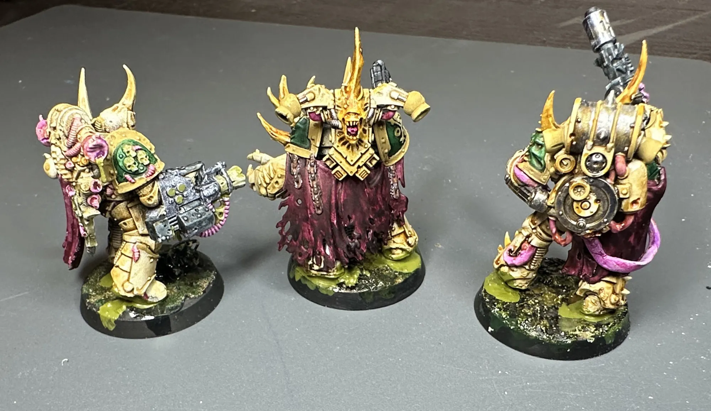

When I repainted my Death Guard from purple to [bone armor with Nurgle corruption](/workshop/death-guard-paint-scheme), the old autumn leaf bases suddenly made no sense. These guys needed to be standing in something that matched the story. Something with so much corruption, so severe, it's poisoning the ground they walk on.

I wanted something that felt like a toxic wasteland without getting complicated. No resin pours, no fancy texture pastes, no buying specialized products. What I ended up with was embarrassingly simple: basing glue mixed with paint.

## The Concept

The idea isn't that these marines are walking through a pre-existing swamp. The corruption is spreading FROM them into the ground. Wherever they step, the earth turns toxic. That distinction matters because it changes how you place the gross stuff. A more concentrated sickly green around and under the feet, spreading outward, not evenly distributed.

## What You Need

Nothing exotic.

- Basing glue (the thick PVA-style stuff made for miniature basing)
- Dark brown paint
- Dark green paint
- A lighter toxic green paint
- Whatever texture material you already use for dirt/earth (sand, texture paste, etc.)

## The Technique

### Step 1: Dark Earth Base

Get your base textured with whatever ground material you normally use. I used textured terrain paint and reminants already on my bases from the previous scheme. Paint it dark! A mix of dark brown and dark green so it reads as dead, poisoned earth rather than healthy dirt. Let it fully cure. This of this as the base layer, the deepest, darkest layer.

### Step 2:a The Toxic Puddles

This is the whole trick. Mix your lighter toxic green paint directly into the basing glue and/or water texture. You want it opaque enough to read as slime but still fluid enough to spread when a model presses into it. What I did was take a little bit of water on my brush and watered the paint down. I then used these watery-paint streaks to add to my mix. Light enough so it reads as a green liquid, not green paint. 

Coat the bottom of the model's feet with the mixture. Press the model down onto the base. Let the glue spread naturally and don't overwork it. The organic squish pattern is what makes it look real. This being said, you'll need a good amount of this mixture on the model's feet, less is less here. 

Take whatever's left on your brush or tool and make puddles around the feet. I tried to do veins spreading outward from the footprints, but honestly it was too fiddly. I ended up just making messy puddles. They looked great anyways. Toxic slime doesn't make neat patterns.

### Step 3: Let It Cure

Don't touch it. The basing glue needs to fully set before you do anything else. If you mess with it while it's tacky you'll lose the texture.

## What Worked

The **characters and Terminators came out great.** I built the toxic effect up in layers. A base layer of the glue mixture, let it dry, then switched to water texture layers on top. That layering gives you depth and variation in the color. Some spots are thicker and more opaque, some are thinner and the dark earth shows through. It looks like toxic sludge at different stages of accumulation.

The **overall contrast with the bone armor is exactly right.** Dark murky base, bright corrupted model on top. The cool greens in the base play against the warm bone and yellow corruption on the marines. It photographs well too (I think).

## What I'd Do Differently

The **[Plague Marine](https://wh40k.lexicanum.com/wiki/Plague_Marine) bases got too much paint in the glue mixture.** I went heavier on the paint ratio than I did with the characters, and it dried too solid. On some of those models, it looks more like a painted surface than a gross, textured sludge. The characters had a better balance where you could still see the translucency and texture of the glue coming through.

I want to go back and build up another layer on top of the Plague Marine bases to fix this. Honestly though, it does still work as a first layer. It's a dried, crusted base of toxicity that I can add wetter-looking stuff on top of. That's basically what worked on the Terminators and characters anyway. Layer it up.

**The glue mixture skins over fast.** Have everything ready before you start mixing. Seriously. Models prepped, bases cured, workspace clear. Once you start, you need to work through the models you set out before the glue gets too tacky to spread naturally. Batch by squad (I'd say no more than five models) so the color stays consistent.

## The Happy Accident

Some of the basing glue spilled over the rims of the bases. It dripped down the sides in a few spots. My first instinct was to clean it up, but I left it and I'm happy I did. It looks like the plague is so toxic it can't be contained within the base. The corruption is literally oozing off the edge.

Could I have done it more intentionally and made it look cleaner? Absolutely. But the effect works, and sometimes the best results come from committing to an accident instead of fighting it.

<!-- TODO: Close-up of toxic puddle texture -->
<!-- TODO: Side view showing rim/spill effect -->

## A Note on Adhesion

The basing glue holds the models to the bases reasonably well for display and casual play. For gaming where models get bumped and picked up a lot, you might want to reinforce it with a thin ring of superglue around the edge where foot meets base after the basing glue is fully cured. Capillary action pulls the superglue underneath and bonds to the plastic.

For characters and bigger models, consider pinning through the foot into the base before the glue step. Belt and suspenders.

---