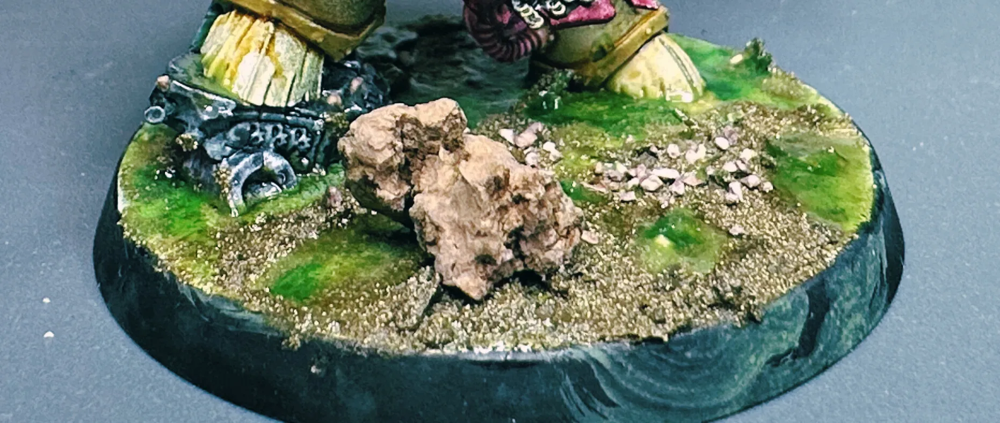
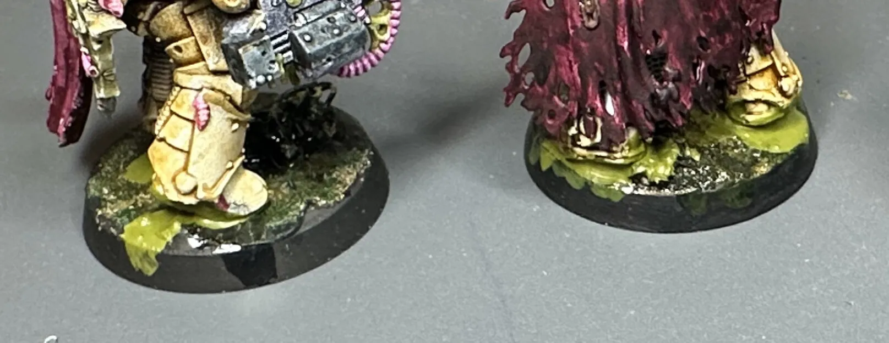
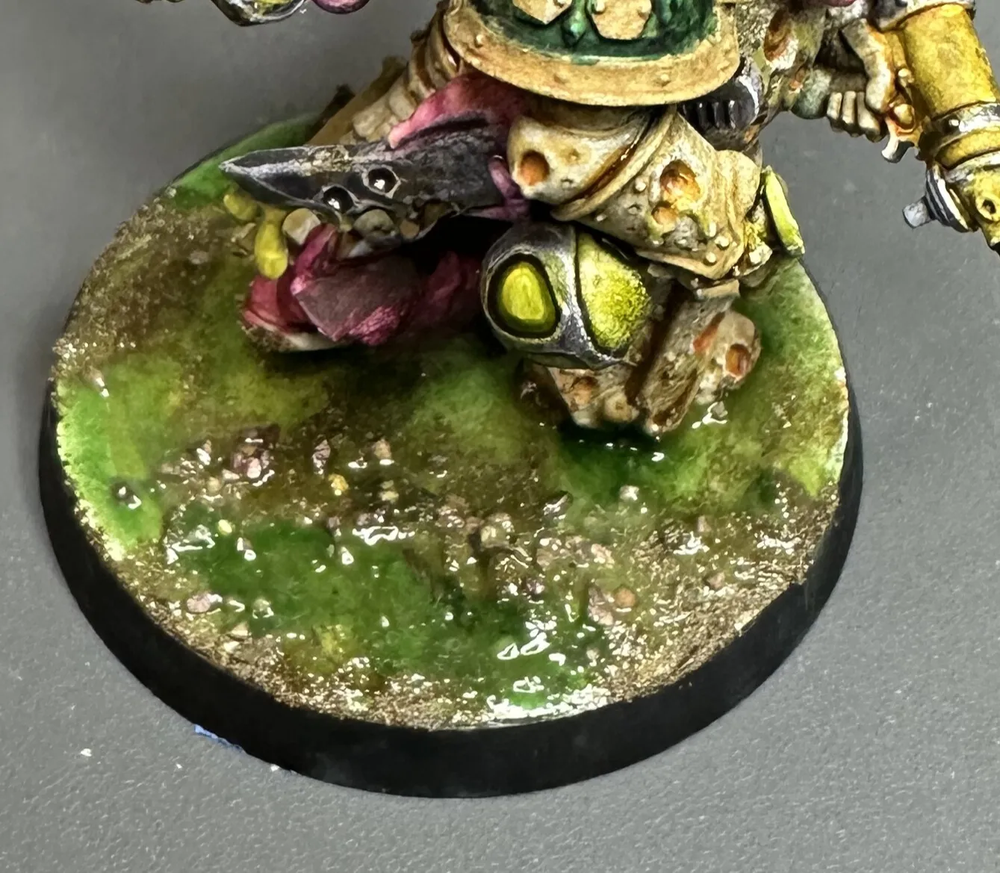
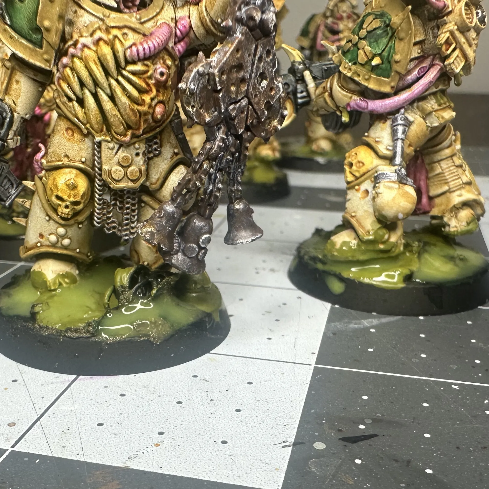
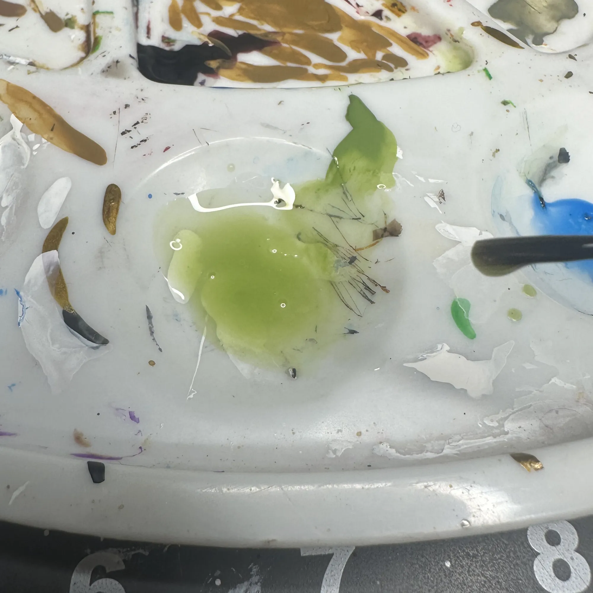
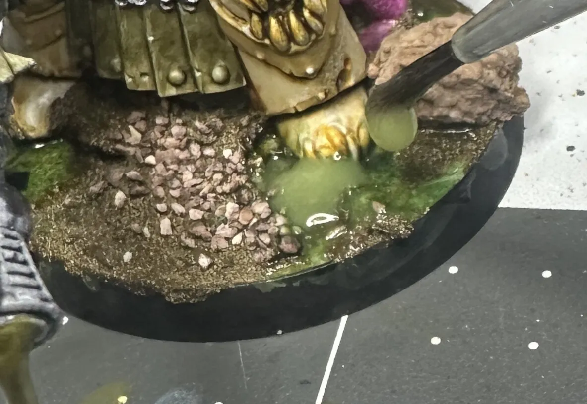
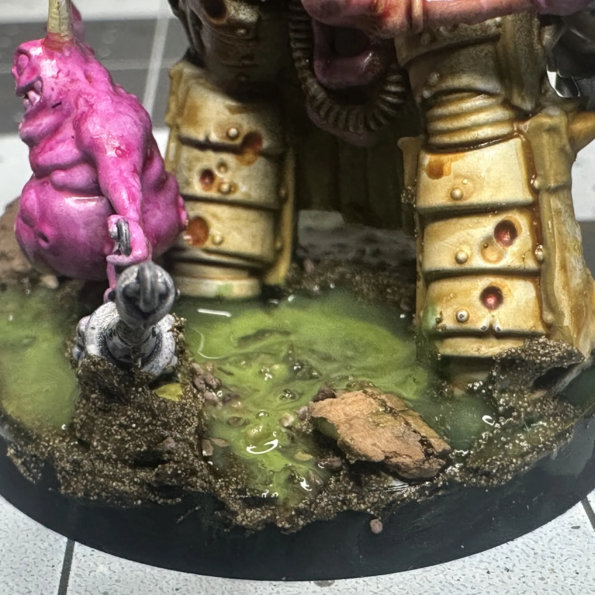
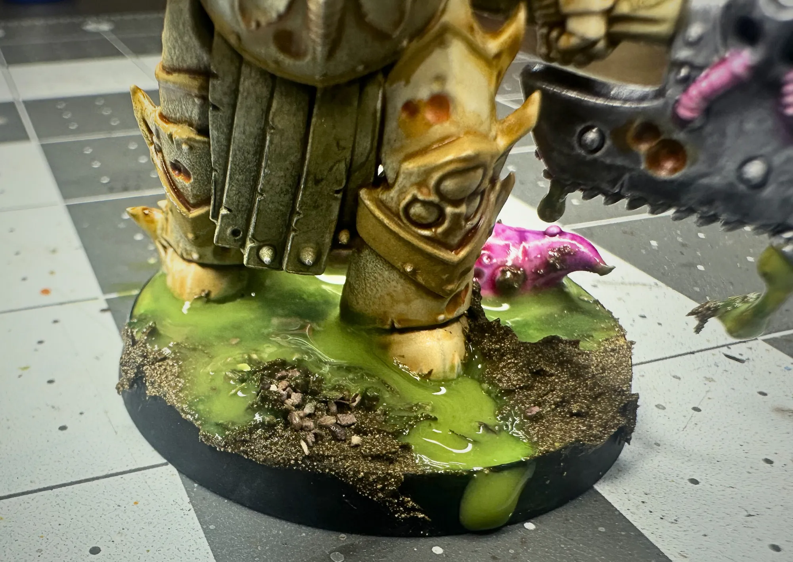

When I repainted my Death Guard from purple to [bone armor with Nurgle corruption](/workshop/death-guard-paint-scheme/), the old autumn leaf bases suddenly made no sense. These guys needed to be standing in something that matched the story. Something with so much corruption, so severe, it's poisoning the ground they walk on.

I wanted something that felt like a toxic wasteland without getting complicated. No resin pours, no fancy texture pastes, no buying specialized products. What I ended up with was embarrassingly simple: basing glue mixed with paint.

## The Concept

The idea isn't that these marines are walking through a pre-existing swamp. The corruption is spreading FROM them into the ground. Wherever they step, the earth turns toxic. That distinction matters because it changes how you place the gross stuff. A more concentrated sickly green around and under the feet, spreading outward, not evenly distributed.

This technique isn't limited to Death Guard either. You can even decide to build this same toxic corruption across a set of [Christmas themed bases](/workshop/christmas-bases/) for a Nurgle-meets-holiday mashup.

## What You Need

Nothing exotic.

- Basing glue (the thick PVA-style stuff made for miniature basing)
- Dark brown paint
- Dark green paint
- A lighter toxic green paint
- Whatever texture material you already use for dirt/earth (sand, texture paste, etc.)

## The Technique

### Step 1: Dark Earth Base

Get your base textured with whatever ground material you normally use. I used textured terrain paint and reminants already on my bases from the previous scheme. Paint it dark! A mix of dark brown and dark green so it reads as dead, poisoned earth rather than healthy dirt. Let it fully cure. This of this as the base layer, the deepest, darkest layer.

### Step 2: The Toxic Puddles

This is the whole trick. Mix your lighter toxic green paint directly into the basing glue and/or water texture. You want it opaque enough to read as slime but still fluid enough to spread when a model presses into it. What I did was take a little bit of water on my brush and watered the paint down. I then used these watery-paint streaks to add to my mix. Light enough so it reads as a green liquid, not green paint. 

Coat the bottom of the model's feet with the mixture. Press the model down onto the base. Let the glue spread naturally and don't overwork it. The organic squish pattern is what makes it look real. This being said, you'll need a good amount of this mixture on the model's feet, less is less here. 

Take whatever's left on your brush or tool and make puddles around the feet. I tried to do veins spreading outward from the footprints, but honestly it was too fiddly. I ended up just making messy puddles. They looked great anyways. Toxic slime doesn't make neat patterns.

### Step 3: Let It Cure

Don't touch it. The basing glue needs to fully set before you do anything else. If you mess with it while it's tacky you'll lose the texture.

## What Worked

The **characters and Terminators came out great.** I built the toxic effect up in layers. A base layer of the glue mixture, let it dry, then switched to water texture layers on top. That layering gives you depth and variation in the color. Some spots are thicker and more opaque, some are thinner and the dark earth shows through. It looks like toxic sludge at different stages of accumulation.

The **overall contrast with the bone armor is exactly right.** Dark murky base, bright corrupted model on top. The cool greens in the base play against the warm bone and yellow corruption on the marines. It photographs well too (I think).

## What I'd Do Differently

The **[Plague Marine](https://wh40k.lexicanum.com/wiki/Plague_Marine) bases got too much paint in the glue mixture.** I went heavier on the paint ratio than I did with the characters, and it dried too solid. On some of those models, it looks more like a painted surface than a gross, textured sludge. The characters had a better balance where you could still see the translucency and texture of the glue coming through.

I want to go back and build up another layer on top of the Plague Marine bases to fix this. Honestly though, it does still work as a first layer. It's a dried, crusted base of toxicity that I can add wetter-looking stuff on top of. That's basically what worked on the Terminators and characters anyway. Layer it up.

**The glue mixture skins over fast.** Have everything ready before you start mixing. Seriously. Models prepped, bases cured, workspace clear. Once you start, you need to work through the models you set out before the glue gets too tacky to spread naturally. Batch by squad (I'd say no more than five models) so the color stays consistent.

## The Happy Accident

Some of the basing glue spilled over the rims of the bases. It dripped down the sides in a few spots. My first instinct was to clean it up, but I left it and I'm happy I did. It looks like the plague is so toxic it can't be contained within the base. The corruption is literally oozing off the edge.

Could I have done it more intentionally and made it look cleaner? Absolutely. But the effect works, and sometimes the best results come from committing to an accident instead of fighting it. 

## A Note on Adhesion

The basing glue holds the models to the bases reasonably well for display and casual play. For gaming where models get bumped and picked up a lot, you might want to reinforce it with a thin ring of superglue around the edge where foot meets base after the basing glue is fully cured. Capillary action pulls the superglue underneath and bonds to the plastic.

For characters and bigger models, consider pinning through the foot into the base before the glue step. Belt and suspenders.

---

## Update: The Layering Fix

After everything dried, I wasn't happy with the Plague Marine bases. They looked like painted surfaces, not toxic sludge. So I went back and built up layers like I did on the characters.

The difference is significant. One coat reads as paint on a base. Three or four coats reads as something wet and foul that you don't want to touch.

### The Process

Each layer is water texture mixed with watered-down paint. Not painted over, but lightly mixed in. The water texture stays translucent even when tinted, so you're stacking colors that show through each other.

Between layers:

- Let it dry completely
- Mix a slightly different green into fresh water texture
- Apply the next coat

That's it.

### Embrace the Mess

Don't try to cover the same areas with each layer. Skip spots. Hit different patches. Let it be random and inconsistent.

If you're building a single uniform puddle, that's a different technique. This is sludge! It's toxic waste dripping off corrupted armor and seeping into the ground. The uneven coverage is what sells it. Some areas get hit with every layer and look thick and saturated. Some spots only caught one coat and look thinner. That variation is the point.

Remember the concept: the corruption spreads FROM the Death Guard. It's not a neat pool they stepped in. It's filth they're leaving... everywhere.

### On Color Choice

Don't overthink what green to use for each layer. Darker, lighter, more yellow, more blue. It genuinely doesn't matter that much. It's toxic waste. There's no "correct" color for fictional slime that's corrupting the ground beneath a plague marine's feet.

Just make it gross. Vary it enough that you get some depth. Move on.

### The Drips

In the original post I mentioned the happy accident with glue spilling over the rim. This time I tried to encourage it intentionally.

The key is letting it happen naturally. Tip the base slightly while the mixture is still wet. Let gravity pull it where it wants to go. Don't try to paint drips on or force them into specific spots. If a drip happens, great. If it doesn't on that base, that's fine too.

What you don't want is every single base with perfectly placed drips in the same spot. That stops looking like accident and starts looking like a design choice. One or two drips per base, varied placement, some bases with none at all.

It's a small thing but it sets these apart. Clean base rims are so standard that your eye skips right past them. A drip catches attention. It says the corruption is so severe it can't be contained. The plague is literally overflowing.

Worth the extra effort? Absolutely. It's barely any effort at all and it makes people pick up the model to look closer.

### The Journey Continues

This army started with a shitty purple paint job that never felt right. Then came the 30K bone armor scheme with autumn leaf bases that made no sense with the new look. Now we're here. Toxic wasteland bases I'm actually excited about and that look cool af.

Next up: redoing the bases on my 40 poxwalkers...ahhh